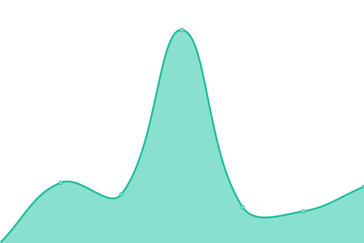
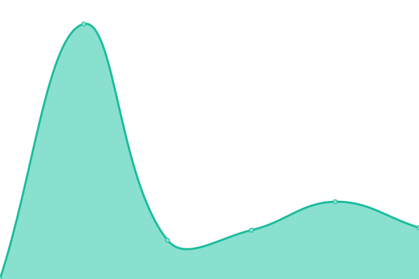
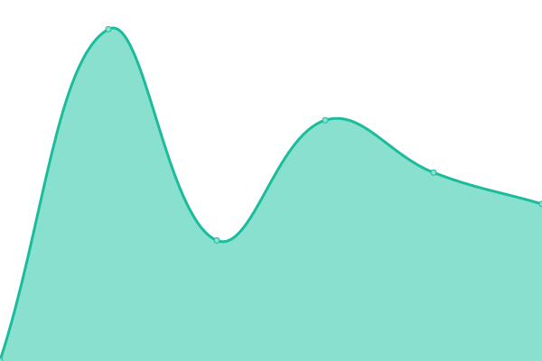
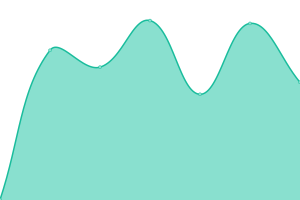
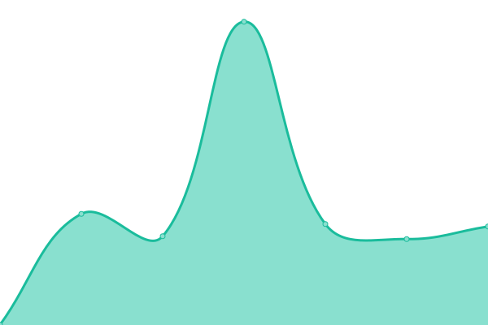
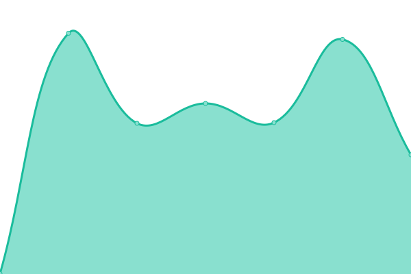
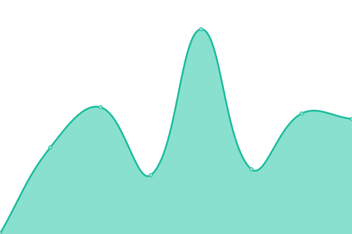
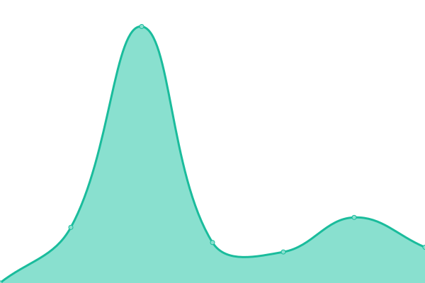

# [📈 Live Status](https://status.innershed.com): <!--live status--> **🟧 Partial outage**

This repository contains the open-source uptime monitor and status page for [InnerShed](https://www.innershed.com), powered by [Upptime](https://github.com/upptime/upptime).

With [Upptime](https://upptime.js.org), you can get your own unlimited and free uptime monitor and status page, powered entirely by a GitHub repository. We use [Issues](https://github.com/innershed/status/issues) as incident reports, [Actions](https://github.com/innershed/status/actions) as uptime monitors, and [Pages](https://status.innershed.com) for the status page.

<!--start: status pages-->
<!-- This summary is generated by Upptime (https://github.com/upptime/upptime) -->
<!-- Do not edit this manually, your changes will be overwritten -->
<!-- prettier-ignore -->
| URL | Status | History | Response Time | Uptime |
| --- | ------ | ------- | ------------- | ------ |
|  [3inoneservices.co.uk](https://3inoneservices.co.uk) | 🟩 Up | [3inoneservices-co-uk.yml](https://github.com/innershed/status/commits/HEAD/history/3inoneservices-co-uk.yml) | 

 1447ms
     
 | 

<a href="https://status.innershed.com/history/3inoneservices-co-uk">100.00%</a>
    

|  [7surreystreet.co.uk](https://7surreystreet.co.uk) | 🟩 Up | [7surreystreet-co-uk.yml](https://github.com/innershed/status/commits/HEAD/history/7surreystreet-co-uk.yml) | 

 431ms
     
 | 

<a href="https://status.innershed.com/history/7surreystreet-co-uk">100.00%</a>
    

|  [abel.construction](https://abel.construction) | 🟩 Up | [abel-construction.yml](https://github.com/innershed/status/commits/HEAD/history/abel-construction.yml) | 

 476ms
     
 | 

<a href="https://status.innershed.com/history/abel-construction">100.00%</a>
    

|  [abelconstruction.co.uk](https://abelconstruction.co.uk) | 🟩 Up | [abelconstruction-co-uk.yml](https://github.com/innershed/status/commits/HEAD/history/abelconstruction-co-uk.yml) | 

 383ms
     
 | 

<a href="https://status.innershed.com/history/abelconstruction-co-uk">100.00%</a>
    

|  [abelenergy.co.uk](https://abelenergy.co.uk) | 🟩 Up | [abelenergy-co-uk.yml](https://github.com/innershed/status/commits/HEAD/history/abelenergy-co-uk.yml) | 

 487ms
     
 | 

<a href="https://status.innershed.com/history/abelenergy-co-uk">100.00%</a>
    

|  [abetterbunch.co.uk](https://abetterbunch.co.uk) | 🟥 Down | [abetterbunch-co-uk.yml](https://github.com/innershed/status/commits/HEAD/history/abetterbunch-co-uk.yml) | 

 0ms
     
 | 

<a href="https://status.innershed.com/history/abetterbunch-co-uk">0.00%</a>
    

|  [agaservicing.com](https://agaservicing.com) | 🟩 Up | [agaservicing-com.yml](https://github.com/innershed/status/commits/HEAD/history/agaservicing-com.yml) | 

 363ms
     
 | 

<a href="https://status.innershed.com/history/agaservicing-com">100.00%</a>
    

|  [allmakemotorparts.com](https://allmakemotorparts.com) | 🟩 Up | [allmakemotorparts-com.yml](https://github.com/innershed/status/commits/HEAD/history/allmakemotorparts-com.yml) | 

 465ms
     
 | 

<a href="https://status.innershed.com/history/allmakemotorparts-com">100.00%</a>
    

|  [allmakemotorparts.co.uk](https://allmakemotorparts.co.uk) | 🟩 Up | [allmakemotorparts-co-uk.yml](https://github.com/innershed/status/commits/HEAD/history/allmakemotorparts-co-uk.yml) | 

 367ms
     
 | 

<a href="https://status.innershed.com/history/allmakemotorparts-co-uk">64.76%</a>
    

|  [alphatango.co.uk](https://alphatango.co.uk) | 🟥 Down | [alphatango-co-uk.yml](https://github.com/innershed/status/commits/HEAD/history/alphatango-co-uk.yml) | 

 0ms
     
 | 

<a href="https://status.innershed.com/history/alphatango-co-uk">0.00%</a>
    

|  [amispiling.co.uk](https://amispiling.co.uk) | 🟩 Up | [amispiling-co-uk.yml](https://github.com/innershed/status/commits/HEAD/history/amispiling-co-uk.yml) | 

 360ms
     
 | 

<a href="https://status.innershed.com/history/amispiling-co-uk">100.00%</a>
    

|  [angliafabrication.co.uk](https://angliafabrication.co.uk) | 🟥 Down | [angliafabrication-co-uk.yml](https://github.com/innershed/status/commits/HEAD/history/angliafabrication-co-uk.yml) | 

 115ms
     
 | 

<a href="https://status.innershed.com/history/angliafabrication-co-uk">0.00%</a>
    

|  [angliakarting.com](https://angliakarting.com) | 🟩 Up | [angliakarting-com.yml](https://github.com/innershed/status/commits/HEAD/history/angliakarting-com.yml) | 

 2796ms
     
 | 

<a href="https://status.innershed.com/history/angliakarting-com">100.00%</a>
    

|  [angliapallets.co.uk](https://angliapallets.co.uk) | 🟩 Up | [angliapallets-co-uk.yml](https://github.com/innershed/status/commits/HEAD/history/angliapallets-co-uk.yml) | 

 798ms
     
 | 

<a href="https://status.innershed.com/history/angliapallets-co-uk">100.00%</a>
    

|  [arwgroup.co.uk](https://arwgroup.co.uk) | 🟩 Up | [arwgroup-co-uk.yml](https://github.com/innershed/status/commits/HEAD/history/arwgroup-co-uk.yml) | 

 333ms
     
 | 

<a href="https://status.innershed.com/history/arwgroup-co-uk">100.00%</a>
    

|  [arwwealthmanagers.co.uk](https://arwwealthmanagers.co.uk) | 🟩 Up | [arwwealthmanagers-co-uk.yml](https://github.com/innershed/status/commits/HEAD/history/arwwealthmanagers-co-uk.yml) | 

 189ms
     
 | 

<a href="https://status.innershed.com/history/arwwealthmanagers-co-uk">100.00%</a>
    

|  [bandahoward.co.uk](https://bandahoward.co.uk) | 🟥 Down | [bandahoward-co-uk.yml](https://github.com/innershed/status/commits/HEAD/history/bandahoward-co-uk.yml) | 

 0ms
     
 | 

<a href="https://status.innershed.com/history/bandahoward-co-uk">0.00%</a>
    

|  [bankboats.co.uk](https://bankboats.co.uk) | 🟩 Up | [bankboats-co-uk.yml](https://github.com/innershed/status/commits/HEAD/history/bankboats-co-uk.yml) | 

 239ms
     
 | 

<a href="https://status.innershed.com/history/bankboats-co-uk">100.00%</a>
    

|  [baybridgeinvestments.com](https://baybridgeinvestments.com) | 🟩 Up | [baybridgeinvestments-com.yml](https://github.com/innershed/status/commits/HEAD/history/baybridgeinvestments-com.yml) | 

 283ms
     
 | 

<a href="https://status.innershed.com/history/baybridgeinvestments-com">100.00%</a>
    

|  [beabutcher.com](https://beabutcher.com) | 🟩 Up | [beabutcher-com.yml](https://github.com/innershed/status/commits/HEAD/history/beabutcher-com.yml) | 

 1081ms
     
 | 

<a href="https://status.innershed.com/history/beabutcher-com">100.00%</a>
    

|  [beabutcher.co.uk](https://beabutcher.co.uk) | 🟩 Up | [beabutcher-co-uk.yml](https://github.com/innershed/status/commits/HEAD/history/beabutcher-co-uk.yml) | 

 380ms
     
 | 

<a href="https://status.innershed.com/history/beabutcher-co-uk">100.00%</a>
    

|  [bedroomsos.co.uk](https://bedroomsos.co.uk) | 🟥 Down | [bedroomsos-co-uk.yml](https://github.com/innershed/status/commits/HEAD/history/bedroomsos-co-uk.yml) | 

 176ms
     
 | 

<a href="https://status.innershed.com/history/bedroomsos-co-uk">0.00%</a>
    

|  [beverley-house.co.uk](https://beverley-house.co.uk) | 🟥 Down | [beverley-house-co-uk.yml](https://github.com/innershed/status/commits/HEAD/history/beverley-house-co-uk.yml) | 

 0ms
     
 | 

<a href="https://status.innershed.com/history/beverley-house-co-uk">0.00%</a>
    

|  [bgd-group.co.uk](https://bgd-group.co.uk) | 🟥 Down | [bgd-group-co-uk.yml](https://github.com/innershed/status/commits/HEAD/history/bgd-group-co-uk.yml) | 

 0ms
     
 | 

<a href="https://status.innershed.com/history/bgd-group-co-uk">0.00%</a>
    

|  [biblerepairs.co.uk](https://biblerepairs.co.uk) | 🟩 Up | [biblerepairs-co-uk.yml](https://github.com/innershed/status/commits/HEAD/history/biblerepairs-co-uk.yml) | 

 514ms
     
 | 

<a href="https://status.innershed.com/history/biblerepairs-co-uk">100.00%</a>
    

|  [birdlife.co.uk](https://birdlife.co.uk) | 🟩 Up | [birdlife-co-uk.yml](https://github.com/innershed/status/commits/HEAD/history/birdlife-co-uk.yml) | 

 492ms
     
 | 

<a href="https://status.innershed.com/history/birdlife-co-uk">100.00%</a>
    

|  [birdsofdereham.com](https://birdsofdereham.com) | 🟩 Up | [birdsofdereham-com.yml](https://github.com/innershed/status/commits/HEAD/history/birdsofdereham-com.yml) | 

 1576ms
     
 | 

<a href="https://status.innershed.com/history/birdsofdereham-com">100.00%</a>
    

|  [birdsofdereham.co.uk](https://birdsofdereham.co.uk) | 🟩 Up | [birdsofdereham-co-uk.yml](https://github.com/innershed/status/commits/HEAD/history/birdsofdereham-co-uk.yml) | 

 1437ms
     
 | 

<a href="https://status.innershed.com/history/birdsofdereham-co-uk">100.00%</a>
    

|  [birds-sport.co.uk](https://birds-sport.co.uk) | 🟥 Down | [birds-sport-co-uk.yml](https://github.com/innershed/status/commits/HEAD/history/birds-sport-co-uk.yml) | 

 0ms
     
 | 

<a href="https://status.innershed.com/history/birds-sport-co-uk">0.00%</a>
    

|  [birds-teamwear.co.uk](https://birds-teamwear.co.uk) | 🟩 Up | [birds-teamwear-co-uk.yml](https://github.com/innershed/status/commits/HEAD/history/birds-teamwear-co-uk.yml) | 

 1392ms
     
 | 

<a href="https://status.innershed.com/history/birds-teamwear-co-uk">100.00%</a>
    

|  [birds-workwear.co.uk](https://birds-workwear.co.uk) | 🟩 Up | [birds-workwear-co-uk.yml](https://github.com/innershed/status/commits/HEAD/history/birds-workwear-co-uk.yml) | 

 1495ms
     
 | 

<a href="https://status.innershed.com/history/birds-workwear-co-uk">100.00%</a>
    

|  [bishopsboats.com](https://bishopsboats.com) | 🟩 Up | [bishopsboats-com.yml](https://github.com/innershed/status/commits/HEAD/history/bishopsboats-com.yml) | 

 2192ms
     
 | 

<a href="https://status.innershed.com/history/bishopsboats-com">100.00%</a>
    

|  [bishopsboats.co.uk](https://bishopsboats.co.uk) | 🟩 Up | [bishopsboats-co-uk.yml](https://github.com/innershed/status/commits/HEAD/history/bishopsboats-co-uk.yml) | 

 2044ms
     
 | 

<a href="https://status.innershed.com/history/bishopsboats-co-uk">100.00%</a>
    

|  [bishybarnabees.co.uk](https://bishybarnabees.co.uk) | 🟩 Up | [bishybarnabees-co-uk.yml](https://github.com/innershed/status/commits/HEAD/history/bishybarnabees-co-uk.yml) | 

 642ms
     
 | 

<a href="https://status.innershed.com/history/bishybarnabees-co-uk">100.00%</a>
    

|  [bishybarnabees.org](https://bishybarnabees.org) | 🟩 Up | [bishybarnabees-org.yml](https://github.com/innershed/status/commits/HEAD/history/bishybarnabees-org.yml) | 

 354ms
     
 | 

<a href="https://status.innershed.com/history/bishybarnabees-org">100.00%</a>
    

|  [blacksheep.ltd.uk](https://blacksheep.ltd.uk) | 🟩 Up | [blacksheep-ltd-uk.yml](https://github.com/innershed/status/commits/HEAD/history/blacksheep-ltd-uk.yml) | 

 327ms
     
 | 

<a href="https://status.innershed.com/history/blacksheep-ltd-uk">100.00%</a>
    

|  [bmn-management.com](https://bmn-management.com) | 🟩 Up | [bmn-management-com.yml](https://github.com/innershed/status/commits/HEAD/history/bmn-management-com.yml) | 

 206ms
     
 | 

<a href="https://status.innershed.com/history/bmn-management-com">100.00%</a>
    

|  [boatsafetyexaminer.com](https://boatsafetyexaminer.com) | 🟩 Up | [boatsafetyexaminer-com.yml](https://github.com/innershed/status/commits/HEAD/history/boatsafetyexaminer-com.yml) | 

 186ms
     
 | 

<a href="https://status.innershed.com/history/boatsafetyexaminer-com">100.00%</a>
    

|  [brundallgardensmarina.com](https://brundallgardensmarina.com) | 🟩 Up | [brundallgardensmarina-com.yml](https://github.com/innershed/status/commits/HEAD/history/brundallgardensmarina-com.yml) | 

 543ms
     
 | 

<a href="https://status.innershed.com/history/brundallgardensmarina-com">100.00%</a>
    

|  [brundallgardensmarina.co.uk](https://brundallgardensmarina.co.uk) | 🟥 Down | [brundallgardensmarina-co-uk.yml](https://github.com/innershed/status/commits/HEAD/history/brundallgardensmarina-co-uk.yml) | 

 0ms
     
 | 

<a href="https://status.innershed.com/history/brundallgardensmarina-co-uk">0.00%</a>
    

|  [burnvalleyfisheries.co.uk](https://burnvalleyfisheries.co.uk) | 🟩 Up | [burnvalleyfisheries-co-uk.yml](https://github.com/innershed/status/commits/HEAD/history/burnvalleyfisheries-co-uk.yml) | 

 462ms
     
 | 

<a href="https://status.innershed.com/history/burnvalleyfisheries-co-uk">100.00%</a>
    

|  [butterleyhouse.co.uk](https://butterleyhouse.co.uk) | 🟥 Down | [butterleyhouse-co-uk.yml](https://github.com/innershed/status/commits/HEAD/history/butterleyhouse-co-uk.yml) | 

 0ms
     
 | 

<a href="https://status.innershed.com/history/butterleyhouse-co-uk">0.00%</a>
    

|  [cafe7surreystreet.co.uk](https://cafe7surreystreet.co.uk) | 🟩 Up | [cafe7surreystreet-co-uk.yml](https://github.com/innershed/status/commits/HEAD/history/cafe7surreystreet-co-uk.yml) | 

 149ms
     
 | 

<a href="https://status.innershed.com/history/cafe7surreystreet-co-uk">100.00%</a>
    

|  [calcotthall.com](https://calcotthall.com) | 🟩 Up | [calcotthall-com.yml](https://github.com/innershed/status/commits/HEAD/history/calcotthall-com.yml) | 

 375ms
     
 | 

<a href="https://status.innershed.com/history/calcotthall-com">100.00%</a>
    

|  [calcotthall.co.uk](https://calcotthall.co.uk) | 🟩 Up | [calcotthall-co-uk.yml](https://github.com/innershed/status/commits/HEAD/history/calcotthall-co-uk.yml) | 

 298ms
     
 | 

<a href="https://status.innershed.com/history/calcotthall-co-uk">100.00%</a>
    

|  [cambridgebookbinders.com](https://cambridgebookbinders.com) | 🟩 Up | [cambridgebookbinders-com.yml](https://github.com/innershed/status/commits/HEAD/history/cambridgebookbinders-com.yml) | 

 570ms
     
 | 

<a href="https://status.innershed.com/history/cambridgebookbinders-com">100.00%</a>
    

|  [cambridgebookbinders.co.uk](https://cambridgebookbinders.co.uk) | 🟩 Up | [cambridgebookbinders-co-uk.yml](https://github.com/innershed/status/commits/HEAD/history/cambridgebookbinders-co-uk.yml) | 

 388ms
     
 | 

<a href="https://status.innershed.com/history/cambridgebookbinders-co-uk">100.00%</a>
    

|  [cambridgebookbinding.com](https://cambridgebookbinding.com) | 🟩 Up | [cambridgebookbinding-com.yml](https://github.com/innershed/status/commits/HEAD/history/cambridgebookbinding-com.yml) | 

 362ms
     
 | 

<a href="https://status.innershed.com/history/cambridgebookbinding-com">100.00%</a>
    

|  [cambridgebookbinding.co.uk](https://cambridgebookbinding.co.uk) | 🟩 Up | [cambridgebookbinding-co-uk.yml](https://github.com/innershed/status/commits/HEAD/history/cambridgebookbinding-co-uk.yml) | 

 434ms
     
 | 

<a href="https://status.innershed.com/history/cambridgebookbinding-co-uk">78.47%</a>
    

|  [cambridgethesisprinting.co.uk](https://cambridgethesisprinting.co.uk) | 🟩 Up | [cambridgethesisprinting-co-uk.yml](https://github.com/innershed/status/commits/HEAD/history/cambridgethesisprinting-co-uk.yml) | 

 297ms
     
 | 

<a href="https://status.innershed.com/history/cambridgethesisprinting-co-uk">100.00%</a>
    

|  [canoethebroads.co.uk](https://canoethebroads.co.uk) | 🟩 Up | [canoethebroads-co-uk.yml](https://github.com/innershed/status/commits/HEAD/history/canoethebroads-co-uk.yml) | 

 269ms
     
 | 

<a href="https://status.innershed.com/history/canoethebroads-co-uk">100.00%</a>
    

|  [caravanman.org.uk](https://caravanman.org.uk) | 🟩 Up | [caravanman-org-uk.yml](https://github.com/innershed/status/commits/HEAD/history/caravanman-org-uk.yml) | 

 441ms
     
 | 

<a href="https://status.innershed.com/history/caravanman-org-uk">100.00%</a>
    

|  [catfieldtaxis.co.uk](https://catfieldtaxis.co.uk) | 🟩 Up | [catfieldtaxis-co-uk.yml](https://github.com/innershed/status/commits/HEAD/history/catfieldtaxis-co-uk.yml) | 

 468ms
     
 | 

<a href="https://status.innershed.com/history/catfieldtaxis-co-uk">100.00%</a>
    

|  [cavaliermailing.com](https://cavaliermailing.com) | 🟩 Up | [cavaliermailing-com.yml](https://github.com/innershed/status/commits/HEAD/history/cavaliermailing-com.yml) | 

 671ms
     
 | 

<a href="https://status.innershed.com/history/cavaliermailing-com">100.00%</a>
    

|  [cawdron.co.uk](https://cawdron.co.uk) | 🟥 Down | [cawdron-co-uk.yml](https://github.com/innershed/status/commits/HEAD/history/cawdron-co-uk.yml) | 

 0ms
     
 | 

<a href="https://status.innershed.com/history/cawdron-co-uk">0.00%</a>
    

|  [cherrytreefarmhouse.com](https://cherrytreefarmhouse.com) | 🟥 Down | [cherrytreefarmhouse-com.yml](https://github.com/innershed/status/commits/HEAD/history/cherrytreefarmhouse-com.yml) | 

 0ms
     
 | 

<a href="https://status.innershed.com/history/cherrytreefarmhouse-com">0.00%</a>
    

|  [churchcottagelangham.co.uk](https://churchcottagelangham.co.uk) | 🟩 Up | [churchcottagelangham-co-uk.yml](https://github.com/innershed/status/commits/HEAD/history/churchcottagelangham-co-uk.yml) | 

 406ms
     
 | 

<a href="https://status.innershed.com/history/churchcottagelangham-co-uk">100.00%</a>
    

|  [clabburn.com](https://clabburn.com) | 🟥 Down | [clabburn-com.yml](https://github.com/innershed/status/commits/HEAD/history/clabburn-com.yml) | 

 0ms
     
 | 

<a href="https://status.innershed.com/history/clabburn-com">0.00%</a>
    

|  [clabburn.co.uk](https://clabburn.co.uk) | 🟩 Up | [clabburn-co-uk.yml](https://github.com/innershed/status/commits/HEAD/history/clabburn-co-uk.yml) | 

 217ms
     
 | 

<a href="https://status.innershed.com/history/clabburn-co-uk">100.00%</a>
    

|  [classiccotton.co.uk](https://classiccotton.co.uk) | 🟩 Up | [classiccotton-co-uk.yml](https://github.com/innershed/status/commits/HEAD/history/classiccotton-co-uk.yml) | 

 196ms
     
 | 

<a href="https://status.innershed.com/history/classiccotton-co-uk">100.00%</a>
    

|  [coastalphotography.co.uk](https://coastalphotography.co.uk) | 🟩 Up | [coastalphotography-co-uk.yml](https://github.com/innershed/status/commits/HEAD/history/coastalphotography-co-uk.yml) | 

 265ms
     
 | 

<a href="https://status.innershed.com/history/coastalphotography-co-uk">100.00%</a>
    

|  [colinsquirepublishing.com](https://colinsquirepublishing.com) | 🟩 Up | [colinsquirepublishing-com.yml](https://github.com/innershed/status/commits/HEAD/history/colinsquirepublishing-com.yml) | 

 414ms
     
 | 

<a href="https://status.innershed.com/history/colinsquirepublishing-com">100.00%</a>
    

|  [connectafrica.net](https://connectafrica.net) | 🟩 Up | [connectafrica-net.yml](https://github.com/innershed/status/commits/HEAD/history/connectafrica-net.yml) | 

 581ms
     
 | 

<a href="https://status.innershed.com/history/connectafrica-net">100.00%</a>
    

|  [coopershouse.co.uk](https://coopershouse.co.uk) | 🟩 Up | [coopershouse-co-uk.yml](https://github.com/innershed/status/commits/HEAD/history/coopershouse-co-uk.yml) | 

 446ms
     
 | 

<a href="https://status.innershed.com/history/coopershouse-co-uk">100.00%</a>
    

|  [cotton-clothing.co.uk](https://cotton-clothing.co.uk) | 🟥 Down | [cotton-clothing-co-uk.yml](https://github.com/innershed/status/commits/HEAD/history/cotton-clothing-co-uk.yml) | 

 0ms
     
 | 

<a href="https://status.innershed.com/history/cotton-clothing-co-uk">0.00%</a>
    

|  [craigdolbyracing.com](https://craigdolbyracing.com) | 🟩 Up | [craigdolbyracing-com.yml](https://github.com/innershed/status/commits/HEAD/history/craigdolbyracing-com.yml) | 

 547ms
     
 | 

<a href="https://status.innershed.com/history/craigdolbyracing-com">100.00%</a>
    

|  [crewairlinetickets.com](https://crewairlinetickets.com) | 🟩 Up | [crewairlinetickets-com.yml](https://github.com/innershed/status/commits/HEAD/history/crewairlinetickets-com.yml) | 

 313ms
     
 | 

<a href="https://status.innershed.com/history/crewairlinetickets-com">100.00%</a>
    

|  [crowshall.co.uk](https://crowshall.co.uk) | 🟩 Up | [crowshall-co-uk.yml](https://github.com/innershed/status/commits/HEAD/history/crowshall-co-uk.yml) | 

 763ms
     
 | 

<a href="https://status.innershed.com/history/crowshall-co-uk">100.00%</a>
    

|  [cubane.co.uk](https://cubane.co.uk) | 🟩 Up | [cubane-co-uk.yml](https://github.com/innershed/status/commits/HEAD/history/cubane-co-uk.yml) | 

 1356ms
     
 | 

<a href="https://status.innershed.com/history/cubane-co-uk">100.00%</a>
    

|  [cubane.org](https://cubane.org) | 🟩 Up | [cubane-org.yml](https://github.com/innershed/status/commits/HEAD/history/cubane-org.yml) | 

 362ms
     
 | 

<a href="https://status.innershed.com/history/cubane-org">100.00%</a>
    

|  [c-u-b.com](https://c-u-b.com) | 🟩 Up | [c-u-b-com.yml](https://github.com/innershed/status/commits/HEAD/history/c-u-b-com.yml) | 

 437ms
     
 | 

<a href="https://status.innershed.com/history/c-u-b-com">100.00%</a>
    

|  [daisysystem.co.uk](https://daisysystem.co.uk) | 🟩 Up | [daisysystem-co-uk.yml](https://github.com/innershed/status/commits/HEAD/history/daisysystem-co-uk.yml) | 

 544ms
     
 | 

<a href="https://status.innershed.com/history/daisysystem-co-uk">100.00%</a>
    

|  [discovernorfolk.co.uk](https://discovernorfolk.co.uk) | 🟩 Up | [discovernorfolk-co-uk.yml](https://github.com/innershed/status/commits/HEAD/history/discovernorfolk-co-uk.yml) | 

 524ms
     
 | 

<a href="https://status.innershed.com/history/discovernorfolk-co-uk">100.00%</a>
    

|  [dom-fox.co.uk](https://dom-fox.co.uk) | 🟩 Up | [dom-fox-co-uk.yml](https://github.com/innershed/status/commits/HEAD/history/dom-fox-co-uk.yml) | 

 303ms
     
 | 

<a href="https://status.innershed.com/history/dom-fox-co-uk">100.00%</a>
    

|  [domfox.co.uk](https://domfox.co.uk) | 🟩 Up | [domfox-co-uk.yml](https://github.com/innershed/status/commits/HEAD/history/domfox-co-uk.yml) | 

 342ms
     
 | 

<a href="https://status.innershed.com/history/domfox-co-uk">100.00%</a>
    

|  [easyroutehosting.co.uk](https://easyroutehosting.co.uk) | 🟩 Up | [easyroutehosting-co-uk.yml](https://github.com/innershed/status/commits/HEAD/history/easyroutehosting-co-uk.yml) | 

 218ms
     
 | 

<a href="https://status.innershed.com/history/easyroutehosting-co-uk">0.00%</a>
    

|  [easyroutehosting.org](https://easyroutehosting.org) | 🟥 Down | [easyroutehosting-org.yml](https://github.com/innershed/status/commits/HEAD/history/easyroutehosting-org.yml) | 

 0ms
     
 | 

<a href="https://status.innershed.com/history/easyroutehosting-org">0.00%</a>
    

|  [edgecharter.com](https://edgecharter.com) | 🟩 Up | [edgecharter-com.yml](https://github.com/innershed/status/commits/HEAD/history/edgecharter-com.yml) | 

 653ms
     
 | 

<a href="https://status.innershed.com/history/edgecharter-com">100.00%</a>
    

|  [edgecharter.co.uk](https://edgecharter.co.uk) | 🟩 Up | [edgecharter-co-uk.yml](https://github.com/innershed/status/commits/HEAD/history/edgecharter-co-uk.yml) | 

 756ms
     
 | 

<a href="https://status.innershed.com/history/edgecharter-co-uk">100.00%</a>
    

|  [edgecharter.fr](https://edgecharter.fr) | 🟩 Up | [edgecharter-fr.yml](https://github.com/innershed/status/commits/HEAD/history/edgecharter-fr.yml) | 

 453ms
     
 | 

<a href="https://status.innershed.com/history/edgecharter-fr">100.00%</a>
    

|  [electricagaservicing.com](https://electricagaservicing.com) | 🟩 Up | [electricagaservicing-com.yml](https://github.com/innershed/status/commits/HEAD/history/electricagaservicing-com.yml) | 

 471ms
     
 | 

<a href="https://status.innershed.com/history/electricagaservicing-com">100.00%</a>
    

|  [elektra-electrical.com](https://elektra-electrical.com) | 🟥 Down | [elektra-electrical-com.yml](https://github.com/innershed/status/commits/HEAD/history/elektra-electrical-com.yml) | 

 144ms
     
 | 

<a href="https://status.innershed.com/history/elektra-electrical-com">0.00%</a>
    

|  [elektra-electrical.co.uk](https://elektra-electrical.co.uk) | 🟩 Up | [elektra-electrical-co-uk.yml](https://github.com/innershed/status/commits/HEAD/history/elektra-electrical-co-uk.yml) | 

 320ms
     
 | 

<a href="https://status.innershed.com/history/elektra-electrical-co-uk">100.00%</a>
    

|  [engraveitnow.co.uk](https://engraveitnow.co.uk) | 🟩 Up | [engraveitnow-co-uk.yml](https://github.com/innershed/status/commits/HEAD/history/engraveitnow-co-uk.yml) | 

 384ms
     
 | 

<a href="https://status.innershed.com/history/engraveitnow-co-uk">100.00%</a>
    

|  [engraversworld.com](https://engraversworld.com) | 🟩 Up | [engraversworld-com.yml](https://github.com/innershed/status/commits/HEAD/history/engraversworld-com.yml) | 

 228ms
     
 | 

<a href="https://status.innershed.com/history/engraversworld-com">100.00%</a>
    

|  [engraversworld.co.uk](https://engraversworld.co.uk) | 🟩 Up | [engraversworld-co-uk.yml](https://github.com/innershed/status/commits/HEAD/history/engraversworld-co-uk.yml) | 

 256ms
     
 | 

<a href="https://status.innershed.com/history/engraversworld-co-uk">100.00%</a>
    

|  [eriba-shop.co.uk](https://eriba-shop.co.uk) | 🟩 Up | [eriba-shop-co-uk.yml](https://github.com/innershed/status/commits/HEAD/history/eriba-shop-co-uk.yml) | 

 276ms
     
 | 

<a href="https://status.innershed.com/history/eriba-shop-co-uk">100.00%</a>
    

|  [eribatouring.co.uk](https://eribatouring.co.uk) | 🟥 Down | [eribatouring-co-uk.yml](https://github.com/innershed/status/commits/HEAD/history/eribatouring-co-uk.yml) | 

 0ms
     
 | 

<a href="https://status.innershed.com/history/eribatouring-co-uk">0.00%</a>
    

|  [europeanmarinesurveys.com](https://europeanmarinesurveys.com) | 🟩 Up | [europeanmarinesurveys-com.yml](https://github.com/innershed/status/commits/HEAD/history/europeanmarinesurveys-com.yml) | 

 766ms
     
 | 

<a href="https://status.innershed.com/history/europeanmarinesurveys-com">100.00%</a>
    

|  [explorewestnorfolk.com](https://explorewestnorfolk.com) | 🟩 Up | [explorewestnorfolk-com.yml](https://github.com/innershed/status/commits/HEAD/history/explorewestnorfolk-com.yml) | 

 453ms
     
 | 

<a href="https://status.innershed.com/history/explorewestnorfolk-com">100.00%</a>
    

|  [explorewestnorfolk.co.uk](https://explorewestnorfolk.co.uk) | 🟩 Up | [explorewestnorfolk-co-uk.yml](https://github.com/innershed/status/commits/HEAD/history/explorewestnorfolk-co-uk.yml) | 

 464ms
     
 | 

<a href="https://status.innershed.com/history/explorewestnorfolk-co-uk">100.00%</a>
    

|  [farthingcottage.co.uk](https://farthingcottage.co.uk) | 🟩 Up | [farthingcottage-co-uk.yml](https://github.com/innershed/status/commits/HEAD/history/farthingcottage-co-uk.yml) | 

 398ms
     
 | 

<a href="https://status.innershed.com/history/farthingcottage-co-uk">100.00%</a>
    

|  [felineexecutivetravel.com](https://felineexecutivetravel.com) | 🟩 Up | [felineexecutivetravel-com.yml](https://github.com/innershed/status/commits/HEAD/history/felineexecutivetravel-com.yml) | 

 456ms
     
 | 

<a href="https://status.innershed.com/history/felineexecutivetravel-com">100.00%</a>
    

|  [felinetravel.com](https://felinetravel.com) | 🟥 Down | [felinetravel-com.yml](https://github.com/innershed/status/commits/HEAD/history/felinetravel-com.yml) | 

 97ms
     
 | 

<a href="https://status.innershed.com/history/felinetravel-com">0.00%</a>
    

|  [felinetravel.co.uk](https://felinetravel.co.uk) | 🟩 Up | [felinetravel-co-uk.yml](https://github.com/innershed/status/commits/HEAD/history/felinetravel-co-uk.yml) | 

 333ms
     
 | 

<a href="https://status.innershed.com/history/felinetravel-co-uk">100.00%</a>
    

|  [fitforyourfuture.co.uk](https://fitforyourfuture.co.uk) | 🟩 Up | [fitforyourfuture-co-uk.yml](https://github.com/innershed/status/commits/HEAD/history/fitforyourfuture-co-uk.yml) | 

 419ms
     
 | 

<a href="https://status.innershed.com/history/fitforyourfuture-co-uk">100.00%</a>
    

|  [fitforyourfuture.org.uk](https://fitforyourfuture.org.uk) | 🟩 Up | [fitforyourfuture-org-uk.yml](https://github.com/innershed/status/commits/HEAD/history/fitforyourfuture-org-uk.yml) | 

 375ms
     
 | 

<a href="https://status.innershed.com/history/fitforyourfuture-org-uk">100.00%</a>
    

|  [fledgeandson.co.uk](https://fledgeandson.co.uk) | 🟥 Down | [fledgeandson-co-uk.yml](https://github.com/innershed/status/commits/HEAD/history/fledgeandson-co-uk.yml) | 

 0ms
     
 | 

<a href="https://status.innershed.com/history/fledgeandson-co-uk">0.00%</a>
    

|  [flitzfotos.com](https://flitzfotos.com) | 🟩 Up | [flitzfotos-com.yml](https://github.com/innershed/status/commits/HEAD/history/flitzfotos-com.yml) | 

 490ms
     
 | 

<a href="https://status.innershed.com/history/flitzfotos-com">100.00%</a>
    

|  [flitzfotos.co.uk](https://flitzfotos.co.uk) | 🟩 Up | [flitzfotos-co-uk.yml](https://github.com/innershed/status/commits/HEAD/history/flitzfotos-co-uk.yml) | 

 369ms
     
 | 

<a href="https://status.innershed.com/history/flitzfotos-co-uk">100.00%</a>
    

|  [flyingclassrooms.co.uk](https://flyingclassrooms.co.uk) | 🟩 Up | [flyingclassrooms-co-uk.yml](https://github.com/innershed/status/commits/HEAD/history/flyingclassrooms-co-uk.yml) | 

 955ms
     
 | 

<a href="https://status.innershed.com/history/flyingclassrooms-co-uk">100.00%</a>
    

|  [freshwatermarine.co.uk](https://freshwatermarine.co.uk) | 🟩 Up | [freshwatermarine-co-uk.yml](https://github.com/innershed/status/commits/HEAD/history/freshwatermarine-co-uk.yml) | 

 476ms
     
 | 

<a href="https://status.innershed.com/history/freshwatermarine-co-uk">100.00%</a>
    

|  [friendsofnorwichmuseums.co.uk](https://friendsofnorwichmuseums.co.uk) | 🟩 Up | [friendsofnorwichmuseums-co-uk.yml](https://github.com/innershed/status/commits/HEAD/history/friendsofnorwichmuseums-co-uk.yml) | 

 713ms
     
 | 

<a href="https://status.innershed.com/history/friendsofnorwichmuseums-co-uk">100.00%</a>
    

|  [friendsofthenorwichmuseums.co.uk](https://friendsofthenorwichmuseums.co.uk) | 🟩 Up | [friendsofthenorwichmuseums-co-uk.yml](https://github.com/innershed/status/commits/HEAD/history/friendsofthenorwichmuseums-co-uk.yml) | 

 519ms
     
 | 

<a href="https://status.innershed.com/history/friendsofthenorwichmuseums-co-uk">100.00%</a>
    

|  [gdscore.com](https://gdscore.com) | 🟩 Up | [gdscore-com.yml](https://github.com/innershed/status/commits/HEAD/history/gdscore-com.yml) | 

 949ms
     
 | 

<a href="https://status.innershed.com/history/gdscore-com">100.00%</a>
    

|  [gdscore.co.uk](https://gdscore.co.uk) | 🟩 Up | [gdscore-co-uk.yml](https://github.com/innershed/status/commits/HEAD/history/gdscore-co-uk.yml) | 

 884ms
     
 | 

<a href="https://status.innershed.com/history/gdscore-co-uk">100.00%</a>
    

|  [genealogyonline.co.uk](https://genealogyonline.co.uk) | 🟩 Up | [genealogyonline-co-uk.yml](https://github.com/innershed/status/commits/HEAD/history/genealogyonline-co-uk.yml) | 

 368ms
     
 | 

<a href="https://status.innershed.com/history/genealogyonline-co-uk">100.00%</a>
    

|  [georgehotelswaffham.co.uk](https://georgehotelswaffham.co.uk) | 🟩 Up | [georgehotelswaffham-co-uk.yml](https://github.com/innershed/status/commits/HEAD/history/georgehotelswaffham-co-uk.yml) | 

 491ms
     
 | 

<a href="https://status.innershed.com/history/georgehotelswaffham-co-uk">100.00%</a>
    

|  [getmyfling.co.uk](https://getmyfling.co.uk) | 🟩 Up | [getmyfling-co-uk.yml](https://github.com/innershed/status/commits/HEAD/history/getmyfling-co-uk.yml) | 

 242ms
     
 | 

<a href="https://status.innershed.com/history/getmyfling-co-uk">100.00%</a>
    

|  [gooderstonewatergardens.co.uk](https://gooderstonewatergardens.co.uk) | 🟩 Up | [gooderstonewatergardens-co-uk.yml](https://github.com/innershed/status/commits/HEAD/history/gooderstonewatergardens-co-uk.yml) | 

 205ms
     
 | 

<a href="https://status.innershed.com/history/gooderstonewatergardens-co-uk">100.00%</a>
    

|  [grangetouring.co.uk](https://grangetouring.co.uk) | 🟩 Up | [grangetouring-co-uk.yml](https://github.com/innershed/status/commits/HEAD/history/grangetouring-co-uk.yml) | 

 369ms
     
 | 

<a href="https://status.innershed.com/history/grangetouring-co-uk">100.00%</a>
    

|  [greatandlittleplumsteadparishcouncil.co.uk](https://greatandlittleplumsteadparishcouncil.co.uk) | 🟩 Up | [greatandlittleplumsteadparishcouncil-co-uk.yml](https://github.com/innershed/status/commits/HEAD/history/greatandlittleplumsteadparishcouncil-co-uk.yml) | 

 474ms
     
 | 

<a href="https://status.innershed.com/history/greatandlittleplumsteadparishcouncil-co-uk">100.00%</a>
    

|  [greatyarmouthminibushire.com](https://greatyarmouthminibushire.com) | 🟩 Up | [greatyarmouthminibushire-com.yml](https://github.com/innershed/status/commits/HEAD/history/greatyarmouthminibushire-com.yml) | 

 308ms
     
 | 

<a href="https://status.innershed.com/history/greatyarmouthminibushire-com">100.00%</a>
    

|  [greatyarmouthminibushire.co.uk](https://greatyarmouthminibushire.co.uk) | 🟩 Up | [greatyarmouthminibushire-co-uk.yml](https://github.com/innershed/status/commits/HEAD/history/greatyarmouthminibushire-co-uk.yml) | 

 278ms
     
 | 

<a href="https://status.innershed.com/history/greatyarmouthminibushire-co-uk">100.00%</a>
    

|  [greensolarfootprint.co.uk](https://greensolarfootprint.co.uk) | 🟩 Up | [greensolarfootprint-co-uk.yml](https://github.com/innershed/status/commits/HEAD/history/greensolarfootprint-co-uk.yml) | 

 2452ms
     
 | 

<a href="https://status.innershed.com/history/greensolarfootprint-co-uk">100.00%</a>
    

|  [gupta-training.co.uk](https://gupta-training.co.uk) | 🟩 Up | [gupta-training-co-uk.yml](https://github.com/innershed/status/commits/HEAD/history/gupta-training-co-uk.yml) | 

 149ms
     
 | 

<a href="https://status.innershed.com/history/gupta-training-co-uk">100.00%</a>
    

|  [haap.co.uk](https://haap.co.uk) | 🟥 Down | [haap-co-uk.yml](https://github.com/innershed/status/commits/HEAD/history/haap-co-uk.yml) | 

 0ms
     
 | 

<a href="https://status.innershed.com/history/haap-co-uk">0.00%</a>
    

|  [hamerton.net](https://hamerton.net) | 🟥 Down | [hamerton-net.yml](https://github.com/innershed/status/commits/HEAD/history/hamerton-net.yml) | 

 0ms
     
 | 

<a href="https://status.innershed.com/history/hamerton-net">0.00%</a>
    

|  [healthnetexpress.com](https://healthnetexpress.com) | 🟥 Down | [healthnetexpress-com.yml](https://github.com/innershed/status/commits/HEAD/history/healthnetexpress-com.yml) | 

 0ms
     
 | 

<a href="https://status.innershed.com/history/healthnetexpress-com">0.00%</a>
    

|  [homers-travel.co.uk](https://homers-travel.co.uk) | 🟩 Up | [homers-travel-co-uk.yml](https://github.com/innershed/status/commits/HEAD/history/homers-travel-co-uk.yml) | 

 665ms
     
 | 

<a href="https://status.innershed.com/history/homers-travel-co-uk">100.00%</a>
    

|  [iafricafoundation.org](https://iafricafoundation.org) | 🟩 Up | [iafricafoundation-org.yml](https://github.com/innershed/status/commits/HEAD/history/iafricafoundation-org.yml) | 

 479ms
     
 | 

<a href="https://status.innershed.com/history/iafricafoundation-org">100.00%</a>
    

|  [ibookingsystem.co.uk](https://ibookingsystem.co.uk) | 🟥 Down | [ibookingsystem-co-uk.yml](https://github.com/innershed/status/commits/HEAD/history/ibookingsystem-co-uk.yml) | 

 181ms
     
 | 

<a href="https://status.innershed.com/history/ibookingsystem-co-uk">0.00%</a>
    

|  [identitydocuments.co.uk](https://identitydocuments.co.uk) | 🟥 Down | [identitydocuments-co-uk.yml](https://github.com/innershed/status/commits/HEAD/history/identitydocuments-co-uk.yml) | 

 0ms
     
 | 

<a href="https://status.innershed.com/history/identitydocuments-co-uk">0.00%</a>
    

|  [identitydocumentsolutions.co.uk](https://identitydocumentsolutions.co.uk) | 🟥 Down | [identitydocumentsolutions-co-uk.yml](https://github.com/innershed/status/commits/HEAD/history/identitydocumentsolutions-co-uk.yml) | 

 0ms
     
 | 

<a href="https://status.innershed.com/history/identitydocumentsolutions-co-uk">0.00%</a>
    

|  [ilearnabout.org](https://ilearnabout.org) | 🟩 Up | [ilearnabout-org.yml](https://github.com/innershed/status/commits/HEAD/history/ilearnabout-org.yml) | 

 516ms
     
 | 

<a href="https://status.innershed.com/history/ilearnabout-org">100.00%</a>
    

|  [innershed.com](https://innershed.com) | 🟩 Up | [innershed-com.yml](https://github.com/innershed/status/commits/HEAD/history/innershed-com.yml) | 

 509ms
     
 | 

<a href="https://status.innershed.com/history/innershed-com">100.00%</a>
    

|  [innershed.co.uk](https://innershed.co.uk) | 🟥 Down | [innershed-co-uk.yml](https://github.com/innershed/status/commits/HEAD/history/innershed-co-uk.yml) | 

 314ms
     
 | 

<a href="https://status.innershed.com/history/innershed-co-uk">0.00%</a>
    

|  [investmentcatalyst.co.uk](https://investmentcatalyst.co.uk) | 🟩 Up | [investmentcatalyst-co-uk.yml](https://github.com/innershed/status/commits/HEAD/history/investmentcatalyst-co-uk.yml) | 

 509ms
     
 | 

<a href="https://status.innershed.com/history/investmentcatalyst-co-uk">100.00%</a>
    

|  [jbarnard.co.uk](https://jbarnard.co.uk) | 🟥 Down | [jbarnard-co-uk.yml](https://github.com/innershed/status/commits/HEAD/history/jbarnard-co-uk.yml) | 

 0ms
     
 | 

<a href="https://status.innershed.com/history/jbarnard-co-uk">0.00%</a>
    

|  [jswilsonandson.com](https://jswilsonandson.com) | 🟩 Up | [jswilsonandson-com.yml](https://github.com/innershed/status/commits/HEAD/history/jswilsonandson-com.yml) | 

 481ms
     
 | 

<a href="https://status.innershed.com/history/jswilsonandson-com">73.29%</a>
    

|  [jswilsonandson.co.uk](https://jswilsonandson.co.uk) | 🟩 Up | [jswilsonandson-co-uk.yml](https://github.com/innershed/status/commits/HEAD/history/jswilsonandson-co-uk.yml) | 

 362ms
     
 | 

<a href="https://status.innershed.com/history/jswilsonandson-co-uk">100.00%</a>
    

|  [justfordog.co.uk](https://justfordog.co.uk) | 🟩 Up | [justfordog-co-uk.yml](https://github.com/innershed/status/commits/HEAD/history/justfordog-co-uk.yml) | 

 212ms
     
 | 

<a href="https://status.innershed.com/history/justfordog-co-uk">100.00%</a>
    

|  [ladiesshootingsociety.co.uk](https://ladiesshootingsociety.co.uk) | 🟥 Down | [ladiesshootingsociety-co-uk.yml](https://github.com/innershed/status/commits/HEAD/history/ladiesshootingsociety-co-uk.yml) | 

 204ms
     
 | 

<a href="https://status.innershed.com/history/ladiesshootingsociety-co-uk">0.00%</a>
    

|  [leadtrackerpro.com](https://leadtrackerpro.com) | 🟩 Up | [leadtrackerpro-com.yml](https://github.com/innershed/status/commits/HEAD/history/leadtrackerpro-com.yml) | 

 406ms
     
 | 

<a href="https://status.innershed.com/history/leadtrackerpro-com">100.00%</a>
    

|  [littleplumsteadbedandbreakfast.com](https://littleplumsteadbedandbreakfast.com) | 🟩 Up | [littleplumsteadbedandbreakfast-com.yml](https://github.com/innershed/status/commits/HEAD/history/littleplumsteadbedandbreakfast-com.yml) | 

 447ms
     
 | 

<a href="https://status.innershed.com/history/littleplumsteadbedandbreakfast-com">100.00%</a>
    

|  [littleplumsteadbedandbreakfast.co.uk](https://littleplumsteadbedandbreakfast.co.uk) | 🟩 Up | [littleplumsteadbedandbreakfast-co-uk.yml](https://github.com/innershed/status/commits/HEAD/history/littleplumsteadbedandbreakfast-co-uk.yml) | 

 399ms
     
 | 

<a href="https://status.innershed.com/history/littleplumsteadbedandbreakfast-co-uk">100.00%</a>
    

|  [long-beach.co.uk](https://long-beach.co.uk) | 🟩 Up | [long-beach-co-uk.yml](https://github.com/innershed/status/commits/HEAD/history/long-beach-co-uk.yml) | 

 345ms
     
 | 

<a href="https://status.innershed.com/history/long-beach-co-uk">100.00%</a>
    

|  [lotribay.com](https://lotribay.com) | 🟩 Up | [lotribay-com.yml](https://github.com/innershed/status/commits/HEAD/history/lotribay-com.yml) | 

 818ms
     
 | 

<a href="https://status.innershed.com/history/lotribay-com">100.00%</a>
    

|  [luxurytoilets.co.uk](https://luxurytoilets.co.uk) | 🟥 Down | [luxurytoilets-co-uk.yml](https://github.com/innershed/status/commits/HEAD/history/luxurytoilets-co-uk.yml) | 

 0ms
     
 | 

<a href="https://status.innershed.com/history/luxurytoilets-co-uk">0.00%</a>
    

|  [mabulazambia.com](https://mabulazambia.com) | 🟥 Down | [mabulazambia-com.yml](https://github.com/innershed/status/commits/HEAD/history/mabulazambia-com.yml) | 

 0ms
     
 | 

<a href="https://status.innershed.com/history/mabulazambia-com">0.00%</a>
    

|  [mabulezi.com](https://mabulezi.com) | 🟥 Down | [mabulezi-com.yml](https://github.com/innershed/status/commits/HEAD/history/mabulezi-com.yml) | 

 0ms
     
 | 

<a href="https://status.innershed.com/history/mabulezi-com">0.00%</a>
    

|  [marinecommunications.com](https://marinecommunications.com) | 🟩 Up | [marinecommunications-com.yml](https://github.com/innershed/status/commits/HEAD/history/marinecommunications-com.yml) | 

 498ms
     
 | 

<a href="https://status.innershed.com/history/marinecommunications-com">100.00%</a>
    

|  [marineconsult.co.uk](https://marineconsult.co.uk) | 🟥 Down | [marineconsult-co-uk.yml](https://github.com/innershed/status/commits/HEAD/history/marineconsult-co-uk.yml) | 

 0ms
     
 | 

<a href="https://status.innershed.com/history/marineconsult-co-uk">0.00%</a>
    

|  [marineconsult.uk](https://marineconsult.uk) | 🟥 Down | [marineconsult-uk.yml](https://github.com/innershed/status/commits/HEAD/history/marineconsult-uk.yml) | 

 0ms
     
 | 

<a href="https://status.innershed.com/history/marineconsult-uk">0.00%</a>
    

|  [marinepowerltd.co.uk](https://marinepowerltd.co.uk) | 🟩 Up | [marinepowerltd-co-uk.yml](https://github.com/innershed/status/commits/HEAD/history/marinepowerltd-co-uk.yml) | 

 1659ms
     
 | 

<a href="https://status.innershed.com/history/marinepowerltd-co-uk">100.00%</a>
    

|  [mcfads.net](https://mcfads.net) | 🟥 Down | [mcfads-net.yml](https://github.com/innershed/status/commits/HEAD/history/mcfads-net.yml) | 

 0ms
     
 | 

<a href="https://status.innershed.com/history/mcfads-net">0.00%</a>
    

|  [mcnamara-sails.com](https://mcnamara-sails.com) | 🟩 Up | [mcnamara-sails-com.yml](https://github.com/innershed/status/commits/HEAD/history/mcnamara-sails-com.yml) | 

 789ms
     
 | 

<a href="https://status.innershed.com/history/mcnamara-sails-com">100.00%</a>
    

|  [middletonhall.co.uk](https://middletonhall.co.uk) | 🟥 Down | [middletonhall-co-uk.yml](https://github.com/innershed/status/commits/HEAD/history/middletonhall-co-uk.yml) | 

 0ms
     
 | 

<a href="https://status.innershed.com/history/middletonhall-co-uk">0.00%</a>
    

|  [middletonhallgolfclub.com](https://middletonhallgolfclub.com) | 🟩 Up | [middletonhallgolfclub-com.yml](https://github.com/innershed/status/commits/HEAD/history/middletonhallgolfclub-com.yml) | 

 1133ms
     
 | 

<a href="https://status.innershed.com/history/middletonhallgolfclub-com">100.00%</a>
    

|  [middletonhallgolfclub.co.uk](https://middletonhallgolfclub.co.uk) | 🟥 Down | [middletonhallgolfclub-co-uk.yml](https://github.com/innershed/status/commits/HEAD/history/middletonhallgolfclub-co-uk.yml) | 

 0ms
     
 | 

<a href="https://status.innershed.com/history/middletonhallgolfclub-co-uk">0.00%</a>
    

|  [milnesafety.co.uk](https://milnesafety.co.uk) | 🟩 Up | [milnesafety-co-uk.yml](https://github.com/innershed/status/commits/HEAD/history/milnesafety-co-uk.yml) | 

 406ms
     
 | 

<a href="https://status.innershed.com/history/milnesafety-co-uk">100.00%</a>
    

|  [minibushirenorwich.co.uk](https://minibushirenorwich.co.uk) | 🟩 Up | [minibushirenorwich-co-uk.yml](https://github.com/innershed/status/commits/HEAD/history/minibushirenorwich-co-uk.yml) | 

 401ms
     
 | 

<a href="https://status.innershed.com/history/minibushirenorwich-co-uk">100.00%</a>
    

|  [momobento.co.uk](https://momobento.co.uk) | 🟥 Down | [momobento-co-uk.yml](https://github.com/innershed/status/commits/HEAD/history/momobento-co-uk.yml) | 

 0ms
     
 | 

<a href="https://status.innershed.com/history/momobento-co-uk">0.00%</a>
    

|  [moonshinelodge.co.uk](https://moonshinelodge.co.uk) | 🟩 Up | [moonshinelodge-co-uk.yml](https://github.com/innershed/status/commits/HEAD/history/moonshinelodge-co-uk.yml) | 

 215ms
     
 | 

<a href="https://status.innershed.com/history/moonshinelodge-co-uk">100.00%</a>
    

|  [naame.co.uk](https://naame.co.uk) | 🟥 Down | [naame-co-uk.yml](https://github.com/innershed/status/commits/HEAD/history/naame-co-uk.yml) | 

 0ms
     
 | 

<a href="https://status.innershed.com/history/naame-co-uk">0.00%</a>
    

|  [navalarchitects.com](https://navalarchitects.com) | 🟩 Up | [navalarchitects-com.yml](https://github.com/innershed/status/commits/HEAD/history/navalarchitects-com.yml) | 

 443ms
     
 | 

<a href="https://status.innershed.com/history/navalarchitects-com">100.00%</a>
    

|  [neomanco.com](https://neomanco.com) | 🟥 Down | [neomanco-com.yml](https://github.com/innershed/status/commits/HEAD/history/neomanco-com.yml) | 

 0ms
     
 | 

<a href="https://status.innershed.com/history/neomanco-com">0.00%</a>
    

|  [norfolkbroadsbandb.com](https://norfolkbroadsbandb.com) | 🟩 Up | [norfolkbroadsbandb-com.yml](https://github.com/innershed/status/commits/HEAD/history/norfolkbroadsbandb-com.yml) | 

 197ms
     
 | 

<a href="https://status.innershed.com/history/norfolkbroadsbandb-com">100.00%</a>
    

|  [norfolkbroads.com](https://norfolkbroads.com) | 🟩 Up | [norfolkbroads-com.yml](https://github.com/innershed/status/commits/HEAD/history/norfolkbroads-com.yml) | 

 792ms
     
 | 

<a href="https://status.innershed.com/history/norfolkbroads-com">100.00%</a>
    

|  [norfolkfhs.org.uk](https://norfolkfhs.org.uk) | 🟩 Up | [norfolkfhs-org-uk.yml](https://github.com/innershed/status/commits/HEAD/history/norfolkfhs-org-uk.yml) | 

 871ms
     
 | 

<a href="https://status.innershed.com/history/norfolkfhs-org-uk">100.00%</a>
    

|  [norfolklive.org](https://norfolklive.org) | 🟩 Up | [norfolklive-org.yml](https://github.com/innershed/status/commits/HEAD/history/norfolklive-org.yml) | 

 453ms
     
 | 

<a href="https://status.innershed.com/history/norfolklive-org">100.00%</a>
    

|  [norfolkonlinerecordsearch.co.uk](https://norfolkonlinerecordsearch.co.uk) | 🟩 Up | [norfolkonlinerecordsearch-co-uk.yml](https://github.com/innershed/status/commits/HEAD/history/norfolkonlinerecordsearch-co-uk.yml) | 

 1243ms
     
 | 

<a href="https://status.innershed.com/history/norfolkonlinerecordsearch-co-uk">100.00%</a>
    

|  [norfolkpestcontrol.co.uk](https://norfolkpestcontrol.co.uk) | 🟩 Up | [norfolkpestcontrol-co-uk.yml](https://github.com/innershed/status/commits/HEAD/history/norfolkpestcontrol-co-uk.yml) | 

 551ms
     
 | 

<a href="https://status.innershed.com/history/norfolkpestcontrol-co-uk">100.00%</a>
    

|  [norkett.com](https://norkett.com) | 🟥 Down | [norkett-com.yml](https://github.com/innershed/status/commits/HEAD/history/norkett-com.yml) | 

 0ms
     
 | 

<a href="https://status.innershed.com/history/norkett-com">0.00%</a>
    

|  [norkett.co.uk](https://norkett.co.uk) | 🟥 Down | [norkett-co-uk.yml](https://github.com/innershed/status/commits/HEAD/history/norkett-co-uk.yml) | 

 0ms
     
 | 

<a href="https://status.innershed.com/history/norkett-co-uk">0.00%</a>
    

|  [northnorfolk.co.uk](https://northnorfolk.co.uk) | 🟩 Up | [northnorfolk-co-uk.yml](https://github.com/innershed/status/commits/HEAD/history/northnorfolk-co-uk.yml) | 

 601ms
     
 | 

<a href="https://status.innershed.com/history/northnorfolk-co-uk">100.00%</a>
    

|  [norwichacupuncture.com](https://norwichacupuncture.com) | 🟩 Up | [norwichacupuncture-com.yml](https://github.com/innershed/status/commits/HEAD/history/norwichacupuncture-com.yml) | 

 591ms
     
 | 

<a href="https://status.innershed.com/history/norwichacupuncture-com">100.00%</a>
    

|  [norwichacupuncture.co.uk](https://norwichacupuncture.co.uk) | 🟩 Up | [norwichacupuncture-co-uk.yml](https://github.com/innershed/status/commits/HEAD/history/norwichacupuncture-co-uk.yml) | 

 338ms
     
 | 

<a href="https://status.innershed.com/history/norwichacupuncture-co-uk">100.00%</a>
    

|  [norwichacupuncturerooms.co.uk](https://norwichacupuncturerooms.co.uk) | 🟩 Up | [norwichacupuncturerooms-co-uk.yml](https://github.com/innershed/status/commits/HEAD/history/norwichacupuncturerooms-co-uk.yml) | 

 301ms
     
 | 

<a href="https://status.innershed.com/history/norwichacupuncturerooms-co-uk">100.00%</a>
    

|  [norwichcamping.co.uk](https://norwichcamping.co.uk) | 🟩 Up | [norwichcamping-co-uk.yml](https://github.com/innershed/status/commits/HEAD/history/norwichcamping-co-uk.yml) | 

 1374ms
     
 | 

<a href="https://status.innershed.com/history/norwichcamping-co-uk">100.00%</a>
    

|  [norwichinns.com](https://norwichinns.com) | 🟩 Up | [norwichinns-com.yml](https://github.com/innershed/status/commits/HEAD/history/norwichinns-com.yml) | 

 1979ms
     
 | 

<a href="https://status.innershed.com/history/norwichinns-com">100.00%</a>
    

|  [norwichinns.co.uk](https://norwichinns.co.uk) | 🟩 Up | [norwichinns-co-uk.yml](https://github.com/innershed/status/commits/HEAD/history/norwichinns-co-uk.yml) | 

 588ms
     
 | 

<a href="https://status.innershed.com/history/norwichinns-co-uk">100.00%</a>
    

|  [oldrectorynorfolk.co.uk](https://oldrectorynorfolk.co.uk) | 🟥 Down | [oldrectorynorfolk-co-uk.yml](https://github.com/innershed/status/commits/HEAD/history/oldrectorynorfolk-co-uk.yml) | 

 0ms
     
 | 

<a href="https://status.innershed.com/history/oldrectorynorfolk-co-uk">0.00%</a>
    

|  [overwatch.org.uk](https://overwatch.org.uk) | 🟩 Up | [overwatch-org-uk.yml](https://github.com/innershed/status/commits/HEAD/history/overwatch-org-uk.yml) | 

 528ms
     
 | 

<a href="https://status.innershed.com/history/overwatch-org-uk">100.00%</a>
    

|  [pacificcruisers.co.uk](https://pacificcruisers.co.uk) | 🟩 Up | [pacificcruisers-co-uk.yml](https://github.com/innershed/status/commits/HEAD/history/pacificcruisers-co-uk.yml) | 

 686ms
     
 | 

<a href="https://status.innershed.com/history/pacificcruisers-co-uk">0.00%</a>
    

|  [paintsurveyors.com](https://paintsurveyors.com) | 🟩 Up | [paintsurveyors-com.yml](https://github.com/innershed/status/commits/HEAD/history/paintsurveyors-com.yml) | 

 442ms
     
 | 

<a href="https://status.innershed.com/history/paintsurveyors-com">100.00%</a>
    

|  [peninsularcottages.com](https://peninsularcottages.com) | 🟥 Down | [peninsularcottages-com.yml](https://github.com/innershed/status/commits/HEAD/history/peninsularcottages-com.yml) | 

 0ms
     
 | 

<a href="https://status.innershed.com/history/peninsularcottages-com">0.00%</a>
    

|  [phoenixfleet.com](https://phoenixfleet.com) | 🟩 Up | [phoenixfleet-com.yml](https://github.com/innershed/status/commits/HEAD/history/phoenixfleet-com.yml) | 

 525ms
     
 | 

<a href="https://status.innershed.com/history/phoenixfleet-com">49.99%</a>
    

|  [playbarnridingcentre.co.uk](https://playbarnridingcentre.co.uk) | 🟩 Up | [playbarnridingcentre-co-uk.yml](https://github.com/innershed/status/commits/HEAD/history/playbarnridingcentre-co-uk.yml) | 

 492ms
     
 | 

<a href="https://status.innershed.com/history/playbarnridingcentre-co-uk">100.00%</a>
    

|  [premiergiftboxes.com](https://premiergiftboxes.com) | 🟥 Down | [premiergiftboxes-com.yml](https://github.com/innershed/status/commits/HEAD/history/premiergiftboxes-com.yml) | 

 166ms
     
 | 

<a href="https://status.innershed.com/history/premiergiftboxes-com">0.00%</a>
    

|  [premierverandahs.co.uk](https://premierverandahs.co.uk) | 🟥 Down | [premierverandahs-co-uk.yml](https://github.com/innershed/status/commits/HEAD/history/premierverandahs-co-uk.yml) | 

 0ms
     
 | 

<a href="https://status.innershed.com/history/premierverandahs-co-uk">0.00%</a>
    

|  [pvsaccess.com](https://pvsaccess.com) | 🟥 Down | [pvsaccess-com.yml](https://github.com/innershed/status/commits/HEAD/history/pvsaccess-com.yml) | 

 0ms
     
 | 

<a href="https://status.innershed.com/history/pvsaccess-com">0.00%</a>
    

|  [pvschina.com](https://pvschina.com) | 🟥 Down | [pvschina-com.yml](https://github.com/innershed/status/commits/HEAD/history/pvschina-com.yml) | 

 0ms
     
 | 

<a href="https://status.innershed.com/history/pvschina-com">0.00%</a>
    

|  [pvsholdings.com](https://pvsholdings.com) | 🟩 Up | [pvsholdings-com.yml](https://github.com/innershed/status/commits/HEAD/history/pvsholdings-com.yml) | 

 2019ms
     
 | 

<a href="https://status.innershed.com/history/pvsholdings-com">100.00%</a>
    

|  [pvsleisure.com](https://pvsleisure.com) | 🟥 Down | [pvsleisure-com.yml](https://github.com/innershed/status/commits/HEAD/history/pvsleisure-com.yml) | 

 0ms
     
 | 

<a href="https://status.innershed.com/history/pvsleisure-com">0.00%</a>
    

|  [rangecleaningservices.co.uk](https://rangecleaningservices.co.uk) | 🟩 Up | [rangecleaningservices-co-uk.yml](https://github.com/innershed/status/commits/HEAD/history/rangecleaningservices-co-uk.yml) | 

 461ms
     
 | 

<a href="https://status.innershed.com/history/rangecleaningservices-co-uk">99.57%</a>
    

|  [rebeccageanty.com](https://rebeccageanty.com) | 🟩 Up | [rebeccageanty-com.yml](https://github.com/innershed/status/commits/HEAD/history/rebeccageanty-com.yml) | 

 376ms
     
 | 

<a href="https://status.innershed.com/history/rebeccageanty-com">100.00%</a>
    

|  [regencyguesthouse.com](https://regencyguesthouse.com) | 🟩 Up | [regencyguesthouse-com.yml](https://github.com/innershed/status/commits/HEAD/history/regencyguesthouse-com.yml) | 

 417ms
     
 | 

<a href="https://status.innershed.com/history/regencyguesthouse-com">100.00%</a>
    

|  [request-shed.com](https://request-shed.com) | 🟩 Up | [request-shed-com.yml](https://github.com/innershed/status/commits/HEAD/history/request-shed-com.yml) | 

 3030ms
     
 | 

<a href="https://status.innershed.com/history/request-shed-com">100.00%</a>
    

|  [ribsofbeef.com](https://ribsofbeef.com) | 🟥 Down | [ribsofbeef-com.yml](https://github.com/innershed/status/commits/HEAD/history/ribsofbeef-com.yml) | 

 0ms
     
 | 

<a href="https://status.innershed.com/history/ribsofbeef-com">0.00%</a>
    

|  [richardhughescookeryschool.com](https://richardhughescookeryschool.com) | 🟥 Down | [richardhughescookeryschool-com.yml](https://github.com/innershed/status/commits/HEAD/history/richardhughescookeryschool-com.yml) | 

 0ms
     
 | 

<a href="https://status.innershed.com/history/richardhughescookeryschool-com">0.00%</a>
    

|  [richardhughescookeryschool.co.uk](https://richardhughescookeryschool.co.uk) | 🟩 Up | [richardhughescookeryschool-co-uk.yml](https://github.com/innershed/status/commits/HEAD/history/richardhughescookeryschool-co-uk.yml) | 

 1158ms
     
 | 

<a href="https://status.innershed.com/history/richardhughescookeryschool-co-uk">100.00%</a>
    

|  [riverside-holidays.co.uk](https://riverside-holidays.co.uk) | 🟩 Up | [riverside-holidays-co-uk.yml](https://github.com/innershed/status/commits/HEAD/history/riverside-holidays-co-uk.yml) | 

 962ms
     
 | 

<a href="https://status.innershed.com/history/riverside-holidays-co-uk">100.00%</a>
    

|  [rookerybarn.com](https://rookerybarn.com) | 🟥 Down | [rookerybarn-com.yml](https://github.com/innershed/status/commits/HEAD/history/rookerybarn-com.yml) | 

 0ms
     
 | 

<a href="https://status.innershed.com/history/rookerybarn-com">0.00%</a>
    

|  [rwesafetyapp.co.uk](https://rwesafetyapp.co.uk) | 🟩 Up | [rwesafetyapp-co-uk.yml](https://github.com/innershed/status/commits/HEAD/history/rwesafetyapp-co-uk.yml) | 

 483ms
     
 | 

<a href="https://status.innershed.com/history/rwesafetyapp-co-uk">100.00%</a>
    

|  [sabenamarine.co.uk](https://sabenamarine.co.uk) | 🟩 Up | [sabenamarine-co-uk.yml](https://github.com/innershed/status/commits/HEAD/history/sabenamarine-co-uk.yml) | 

 423ms
     
 | 

<a href="https://status.innershed.com/history/sabenamarine-co-uk">100.00%</a>
    

|  [sandersonmarine.co.uk](https://sandersonmarine.co.uk) | 🟩 Up | [sandersonmarine-co-uk.yml](https://github.com/innershed/status/commits/HEAD/history/sandersonmarine-co-uk.yml) | 

 447ms
     
 | 

<a href="https://status.innershed.com/history/sandersonmarine-co-uk">100.00%</a>
    

|  [sayonaravacances.co.uk](https://sayonaravacances.co.uk) | 🟩 Up | [sayonaravacances-co-uk.yml](https://github.com/innershed/status/commits/HEAD/history/sayonaravacances-co-uk.yml) | 

 385ms
     
 | 

<a href="https://status.innershed.com/history/sayonaravacances-co-uk">100.00%</a>
    

|  [schoolwear-uk.com](https://schoolwear-uk.com) | 🟩 Up | [schoolwear-uk-com.yml](https://github.com/innershed/status/commits/HEAD/history/schoolwear-uk-com.yml) | 

 1489ms
     
 | 

<a href="https://status.innershed.com/history/schoolwear-uk-com">100.00%</a>
    

|  [schoolwear-uk.co.uk](https://schoolwear-uk.co.uk) | 🟩 Up | [schoolwear-uk-co-uk.yml](https://github.com/innershed/status/commits/HEAD/history/schoolwear-uk-co-uk.yml) | 

 1437ms
     
 | 

<a href="https://status.innershed.com/history/schoolwear-uk-co-uk">100.00%</a>
    

|  [scuttlebutt.co.uk](https://scuttlebutt.co.uk) | 🟩 Up | [scuttlebutt-co-uk.yml](https://github.com/innershed/status/commits/HEAD/history/scuttlebutt-co-uk.yml) | 

 556ms
     
 | 

<a href="https://status.innershed.com/history/scuttlebutt-co-uk">100.00%</a>
    

|  [seadellbar.co.uk](https://seadellbar.co.uk) | 🟩 Up | [seadellbar-co-uk.yml](https://github.com/innershed/status/commits/HEAD/history/seadellbar-co-uk.yml) | 

 1575ms
     
 | 

<a href="https://status.innershed.com/history/seadellbar-co-uk">100.00%</a>
    

|  [seafoodnorthnorfolk.co.uk](https://seafoodnorthnorfolk.co.uk) | 🟩 Up | [seafoodnorthnorfolk-co-uk.yml](https://github.com/innershed/status/commits/HEAD/history/seafoodnorthnorfolk-co-uk.yml) | 

 468ms
     
 | 

<a href="https://status.innershed.com/history/seafoodnorthnorfolk-co-uk">100.00%</a>
    

|  [sequoiatreeservices.co.uk](https://sequoiatreeservices.co.uk) | 🟥 Down | [sequoiatreeservices-co-uk.yml](https://github.com/innershed/status/commits/HEAD/history/sequoiatreeservices-co-uk.yml) | 

 485ms
     
 | 

<a href="https://status.innershed.com/history/sequoiatreeservices-co-uk">100.00%</a>
    

|  [shadowboats.co.uk](https://shadowboats.co.uk) | 🟩 Up | [shadowboats-co-uk.yml](https://github.com/innershed/status/commits/HEAD/history/shadowboats-co-uk.yml) | 

 1324ms
     
 | 

<a href="https://status.innershed.com/history/shadowboats-co-uk">100.00%</a>
    

|  [sheringhamselfcatering.co.uk](https://sheringhamselfcatering.co.uk) | 🟩 Up | [sheringhamselfcatering-co-uk.yml](https://github.com/innershed/status/commits/HEAD/history/sheringhamselfcatering-co-uk.yml) | 

 452ms
     
 | 

<a href="https://status.innershed.com/history/sheringhamselfcatering-co-uk">100.00%</a>
    

|  [shirtlogos.co.uk](https://shirtlogos.co.uk) | 🟩 Up | [shirtlogos-co-uk.yml](https://github.com/innershed/status/commits/HEAD/history/shirtlogos-co-uk.yml) | 

 447ms
     
 | 

<a href="https://status.innershed.com/history/shirtlogos-co-uk">100.00%</a>
    

|  [shredstation.co.uk](https://shredstation.co.uk) | 🟩 Up | [shredstation-co-uk.yml](https://github.com/innershed/status/commits/HEAD/history/shredstation-co-uk.yml) | 

 1238ms
     
 | 

<a href="https://status.innershed.com/history/shredstation-co-uk">100.00%</a>
    

|  [shrublandsfarm.com](https://shrublandsfarm.com) | 🟩 Up | [shrublandsfarm-com.yml](https://github.com/innershed/status/commits/HEAD/history/shrublandsfarm-com.yml) | 

 430ms
     
 | 

<a href="https://status.innershed.com/history/shrublandsfarm-com">100.00%</a>
    

|  [sloleyfarmcottages.co.uk](https://sloleyfarmcottages.co.uk) | 🟩 Up | [sloleyfarmcottages-co-uk.yml](https://github.com/innershed/status/commits/HEAD/history/sloleyfarmcottages-co-uk.yml) | 

 1106ms
     
 | 

<a href="https://status.innershed.com/history/sloleyfarmcottages-co-uk">100.00%</a>
    

|  [smartpaws.ch](https://smartpaws.ch) | 🟩 Up | [smartpaws-ch.yml](https://github.com/innershed/status/commits/HEAD/history/smartpaws-ch.yml) | 

 1337ms
     
 | 

<a href="https://status.innershed.com/history/smartpaws-ch">100.00%</a>
    

|  [smartpaws.de](https://smartpaws.de) | 🟩 Up | [smartpaws-de.yml](https://github.com/innershed/status/commits/HEAD/history/smartpaws-de.yml) | 

 1225ms
     
 | 

<a href="https://status.innershed.com/history/smartpaws-de">100.00%</a>
    

|  [southeastcoffee.co.uk](https://southeastcoffee.co.uk) | 🟩 Up | [southeastcoffee-co-uk.yml](https://github.com/innershed/status/commits/HEAD/history/southeastcoffee-co-uk.yml) | 

 828ms
     
 | 

<a href="https://status.innershed.com/history/southeastcoffee-co-uk">100.00%</a>
    

|  [stalhamminibus.co.uk](https://stalhamminibus.co.uk) | 🟩 Up | [stalhamminibus-co-uk.yml](https://github.com/innershed/status/commits/HEAD/history/stalhamminibus-co-uk.yml) | 

 374ms
     
 | 

<a href="https://status.innershed.com/history/stalhamminibus-co-uk">100.00%</a>
    

|  [stills-photography.com](https://stills-photography.com) | 🟩 Up | [stills-photography-com.yml](https://github.com/innershed/status/commits/HEAD/history/stills-photography-com.yml) | 

 527ms
     
 | 

<a href="https://status.innershed.com/history/stills-photography-com">100.00%</a>
    

|  [stills-photography.co.uk](https://stills-photography.co.uk) | 🟩 Up | [stills-photography-co-uk.yml](https://github.com/innershed/status/commits/HEAD/history/stills-photography-co-uk.yml) | 

 217ms
     
 | 

<a href="https://status.innershed.com/history/stills-photography-co-uk">100.00%</a>
    

|  [suelamberttrust.org](https://suelamberttrust.org) | 🟩 Up | [suelamberttrust-org.yml](https://github.com/innershed/status/commits/HEAD/history/suelamberttrust-org.yml) | 

 431ms
     
 | 

<a href="https://status.innershed.com/history/suelamberttrust-org">100.00%</a>
    

|  [suffolkbroads.com](https://suffolkbroads.com) | 🟥 Down | [suffolkbroads-com.yml](https://github.com/innershed/status/commits/HEAD/history/suffolkbroads-com.yml) | 

 0ms
     
 | 

<a href="https://status.innershed.com/history/suffolkbroads-com">0.00%</a>
    

|  [summercraftboats.com](https://summercraftboats.com) | 🟩 Up | [summercraftboats-com.yml](https://github.com/innershed/status/commits/HEAD/history/summercraftboats-com.yml) | 

 722ms
     
 | 

<a href="https://status.innershed.com/history/summercraftboats-com">100.00%</a>
    

|  [summercraftboats.co.uk](https://summercraftboats.co.uk) | 🟩 Up | [summercraftboats-co-uk.yml](https://github.com/innershed/status/commits/HEAD/history/summercraftboats-co-uk.yml) | 

 332ms
     
 | 

<a href="https://status.innershed.com/history/summercraftboats-co-uk">100.00%</a>
    

|  [superyachtagents.com](https://superyachtagents.com) | 🟩 Up | [superyachtagents-com.yml](https://github.com/innershed/status/commits/HEAD/history/superyachtagents-com.yml) | 

 520ms
     
 | 

<a href="https://status.innershed.com/history/superyachtagents-com">100.00%</a>
    

|  [superyachtantifouling.com](https://superyachtantifouling.com) | 🟩 Up | [superyachtantifouling-com.yml](https://github.com/innershed/status/commits/HEAD/history/superyachtantifouling-com.yml) | 

 454ms
     
 | 

<a href="https://status.innershed.com/history/superyachtantifouling-com">100.00%</a>
    

|  [superyachtawnings.com](https://superyachtawnings.com) | 🟩 Up | [superyachtawnings-com.yml](https://github.com/innershed/status/commits/HEAD/history/superyachtawnings-com.yml) | 

 417ms
     
 | 

<a href="https://status.innershed.com/history/superyachtawnings-com">100.00%</a>
    

|  [superyacht-berths.com](https://superyacht-berths.com) | 🟩 Up | [superyacht-berths-com.yml](https://github.com/innershed/status/commits/HEAD/history/superyacht-berths-com.yml) | 

 562ms
     
 | 

<a href="https://status.innershed.com/history/superyacht-berths-com">100.00%</a>
    

|  [superyachtbrokers.com](https://superyachtbrokers.com) | 🟩 Up | [superyachtbrokers-com.yml](https://github.com/innershed/status/commits/HEAD/history/superyachtbrokers-com.yml) | 

 423ms
     
 | 

<a href="https://status.innershed.com/history/superyachtbrokers-com">100.00%</a>
    

|  [superyachtbuilders.com](https://superyachtbuilders.com) | 🟩 Up | [superyachtbuilders-com.yml](https://github.com/innershed/status/commits/HEAD/history/superyachtbuilders-com.yml) | 

 432ms
     
 | 

<a href="https://status.innershed.com/history/superyachtbuilders-com">100.00%</a>
    

|  [superyachtcaptains.com](https://superyachtcaptains.com) | 🟩 Up | [superyachtcaptains-com.yml](https://github.com/innershed/status/commits/HEAD/history/superyachtcaptains-com.yml) | 

 257ms
     
 | 

<a href="https://status.innershed.com/history/superyachtcaptains-com">100.00%</a>
    

|  [superyachtcarpets.com](https://superyachtcarpets.com) | 🟩 Up | [superyachtcarpets-com.yml](https://github.com/innershed/status/commits/HEAD/history/superyachtcarpets-com.yml) | 

 414ms
     
 | 

<a href="https://status.innershed.com/history/superyachtcarpets-com">100.00%</a>
    

|  [superyachtchandlers.com](https://superyachtchandlers.com) | 🟩 Up | [superyachtchandlers-com.yml](https://github.com/innershed/status/commits/HEAD/history/superyachtchandlers-com.yml) | 

 437ms
     
 | 

<a href="https://status.innershed.com/history/superyachtchandlers-com">100.00%</a>
    

|  [superyachtcharters.com](https://superyachtcharters.com) | 🟩 Up | [superyachtcharters-com.yml](https://github.com/innershed/status/commits/HEAD/history/superyachtcharters-com.yml) | 

 432ms
     
 | 

<a href="https://status.innershed.com/history/superyachtcharters-com">100.00%</a>
    

|  [superyachtchefs.com](https://superyachtchefs.com) | 🟩 Up | [superyachtchefs-com.yml](https://github.com/innershed/status/commits/HEAD/history/superyachtchefs-com.yml) | 

 434ms
     
 | 

<a href="https://status.innershed.com/history/superyachtchefs-com">100.00%</a>
    

|  [superyachtconnect.com](https://superyachtconnect.com) | 🟩 Up | [superyachtconnect-com.yml](https://github.com/innershed/status/commits/HEAD/history/superyachtconnect-com.yml) | 

 415ms
     
 | 

<a href="https://status.innershed.com/history/superyachtconnect-com">100.00%</a>
    

|  [superyachtcrewagents.com](https://superyachtcrewagents.com) | 🟩 Up | [superyachtcrewagents-com.yml](https://github.com/innershed/status/commits/HEAD/history/superyachtcrewagents-com.yml) | 

 435ms
     
 | 

<a href="https://status.innershed.com/history/superyachtcrewagents-com">100.00%</a>
    

|  [superyachtcrew.com](https://superyachtcrew.com) | 🟩 Up | [superyachtcrew-com.yml](https://github.com/innershed/status/commits/HEAD/history/superyachtcrew-com.yml) | 

 404ms
     
 | 

<a href="https://status.innershed.com/history/superyachtcrew-com">100.00%</a>
    

|  [superyachtdecks.com](https://superyachtdecks.com) | 🟥 Down | [superyachtdecks-com.yml](https://github.com/innershed/status/commits/HEAD/history/superyachtdecks-com.yml) | 

 178ms
     
 | 

<a href="https://status.innershed.com/history/superyachtdecks-com">0.00%</a>
    

|  [superyachtdesigner.com](https://superyachtdesigner.com) | 🟩 Up | [superyachtdesigner-com.yml](https://github.com/innershed/status/commits/HEAD/history/superyachtdesigner-com.yml) | 

 403ms
     
 | 

<a href="https://status.innershed.com/history/superyachtdesigner-com">100.00%</a>
    

|  [superyachtelectronics.com](https://superyachtelectronics.com) | 🟩 Up | [superyachtelectronics-com.yml](https://github.com/innershed/status/commits/HEAD/history/superyachtelectronics-com.yml) | 

 413ms
     
 | 

<a href="https://status.innershed.com/history/superyachtelectronics-com">100.00%</a>
    

|  [superyachtengineer.com](https://superyachtengineer.com) | 🟩 Up | [superyachtengineer-com.yml](https://github.com/innershed/status/commits/HEAD/history/superyachtengineer-com.yml) | 

 407ms
     
 | 

<a href="https://status.innershed.com/history/superyachtengineer-com">100.00%</a>
    

|  [superyachtentertainmentsystems.com](https://superyachtentertainmentsystems.com) | 🟩 Up | [superyachtentertainmentsystems-com.yml](https://github.com/innershed/status/commits/HEAD/history/superyachtentertainmentsystems-com.yml) | 

 470ms
     
 | 

<a href="https://status.innershed.com/history/superyachtentertainmentsystems-com">100.00%</a>
    

|  [superyachtfuel.com](https://superyachtfuel.com) | 🟩 Up | [superyachtfuel-com.yml](https://github.com/innershed/status/commits/HEAD/history/superyachtfuel-com.yml) | 

 427ms
     
 | 

<a href="https://status.innershed.com/history/superyachtfuel-com">100.00%</a>
    

|  [superyachtfurniture.com](https://superyachtfurniture.com) | 🟩 Up | [superyachtfurniture-com.yml](https://github.com/innershed/status/commits/HEAD/history/superyachtfurniture-com.yml) | 

 469ms
     
 | 

<a href="https://status.innershed.com/history/superyachtfurniture-com">100.00%</a>
    

|  [superyachtgalley.com](https://superyachtgalley.com) | 🟩 Up | [superyachtgalley-com.yml](https://github.com/innershed/status/commits/HEAD/history/superyachtgalley-com.yml) | 

 426ms
     
 | 

<a href="https://status.innershed.com/history/superyachtgalley-com">100.00%</a>
    

|  [superyachtgangways.com](https://superyachtgangways.com) | 🟩 Up | [superyachtgangways-com.yml](https://github.com/innershed/status/commits/HEAD/history/superyachtgangways-com.yml) | 

 455ms
     
 | 

<a href="https://status.innershed.com/history/superyachtgangways-com">100.00%</a>
    

|  [superyachthealth.com](https://superyachthealth.com) | 🟩 Up | [superyachthealth-com.yml](https://github.com/innershed/status/commits/HEAD/history/superyachthealth-com.yml) | 

 419ms
     
 | 

<a href="https://status.innershed.com/history/superyachthealth-com">100.00%</a>
    

|  [superyachthorns.com](https://superyachthorns.com) | 🟩 Up | [superyachthorns-com.yml](https://github.com/innershed/status/commits/HEAD/history/superyachthorns-com.yml) | 

 433ms
     
 | 

<a href="https://status.innershed.com/history/superyachthorns-com">100.00%</a>
    

|  [superyachtinsurance.com](https://superyachtinsurance.com) | 🟩 Up | [superyachtinsurance-com.yml](https://github.com/innershed/status/commits/HEAD/history/superyachtinsurance-com.yml) | 

 430ms
     
 | 

<a href="https://status.innershed.com/history/superyachtinsurance-com">100.00%</a>
    

|  [superyachtlights.com](https://superyachtlights.com) | 🟩 Up | [superyachtlights-com.yml](https://github.com/innershed/status/commits/HEAD/history/superyachtlights-com.yml) | 

 424ms
     
 | 

<a href="https://status.innershed.com/history/superyachtlights-com">100.00%</a>
    

|  [superyachtmarinas.com](https://superyachtmarinas.com) | 🟩 Up | [superyachtmarinas-com.yml](https://github.com/innershed/status/commits/HEAD/history/superyachtmarinas-com.yml) | 

 461ms
     
 | 

<a href="https://status.innershed.com/history/superyachtmarinas-com">100.00%</a>
    

|  [superyachtmasts.com](https://superyachtmasts.com) | 🟩 Up | [superyachtmasts-com.yml](https://github.com/innershed/status/commits/HEAD/history/superyachtmasts-com.yml) | 

 431ms
     
 | 

<a href="https://status.innershed.com/history/superyachtmasts-com">100.00%</a>
    

|  [superyachtpaint.com](https://superyachtpaint.com) | 🟩 Up | [superyachtpaint-com.yml](https://github.com/innershed/status/commits/HEAD/history/superyachtpaint-com.yml) | 

 467ms
     
 | 

<a href="https://status.innershed.com/history/superyachtpaint-com">100.00%</a>
    

|  [superyachtpainters.com](https://superyachtpainters.com) | 🟩 Up | [superyachtpainters-com.yml](https://github.com/innershed/status/commits/HEAD/history/superyachtpainters-com.yml) | 

 435ms
     
 | 

<a href="https://status.innershed.com/history/superyachtpainters-com">100.00%</a>
    

|  [superyachtphotographer.com](https://superyachtphotographer.com) | 🟩 Up | [superyachtphotographer-com.yml](https://github.com/innershed/status/commits/HEAD/history/superyachtphotographer-com.yml) | 

 426ms
     
 | 

<a href="https://status.innershed.com/history/superyachtphotographer-com">100.00%</a>
    

|  [superyachtprofessionals.com](https://superyachtprofessionals.com) | 🟩 Up | [superyachtprofessionals-com.yml](https://github.com/innershed/status/commits/HEAD/history/superyachtprofessionals-com.yml) | 

 201ms
     
 | 

<a href="https://status.innershed.com/history/superyachtprofessionals-com">100.00%</a>
    

|  [superyachtpropellers.com](https://superyachtpropellers.com) | 🟩 Up | [superyachtpropellers-com.yml](https://github.com/innershed/status/commits/HEAD/history/superyachtpropellers-com.yml) | 

 410ms
     
 | 

<a href="https://status.innershed.com/history/superyachtpropellers-com">100.00%</a>
    

|  [superyachtprovisions.com](https://superyachtprovisions.com) | 🟩 Up | [superyachtprovisions-com.yml](https://github.com/innershed/status/commits/HEAD/history/superyachtprovisions-com.yml) | 

 441ms
     
 | 

<a href="https://status.innershed.com/history/superyachtprovisions-com">100.00%</a>
    

|  [superyachtrefit.com](https://superyachtrefit.com) | 🟩 Up | [superyachtrefit-com.yml](https://github.com/innershed/status/commits/HEAD/history/superyachtrefit-com.yml) | 

 516ms
     
 | 

<a href="https://status.innershed.com/history/superyachtrefit-com">100.00%</a>
    

|  [superyachtsafetyequipment.com](https://superyachtsafetyequipment.com) | 🟩 Up | [superyachtsafetyequipment-com.yml](https://github.com/innershed/status/commits/HEAD/history/superyachtsafetyequipment-com.yml) | 

 520ms
     
 | 

<a href="https://status.innershed.com/history/superyachtsafetyequipment-com">100.00%</a>
    

|  [superyachtsails.com](https://superyachtsails.com) | 🟩 Up | [superyachtsails-com.yml](https://github.com/innershed/status/commits/HEAD/history/superyachtsails-com.yml) | 

 404ms
     
 | 

<a href="https://status.innershed.com/history/superyachtsails-com">100.00%</a>
    

|  [superyachtsecuritycompanies.com](https://superyachtsecuritycompanies.com) | 🟩 Up | [superyachtsecuritycompanies-com.yml](https://github.com/innershed/status/commits/HEAD/history/superyachtsecuritycompanies-com.yml) | 

 444ms
     
 | 

<a href="https://status.innershed.com/history/superyachtsecuritycompanies-com">100.00%</a>
    

|  [superyachtsforsale.com](https://superyachtsforsale.com) | 🟥 Down | [superyachtsforsale-com.yml](https://github.com/innershed/status/commits/HEAD/history/superyachtsforsale-com.yml) | 

 198ms
     
 | 

<a href="https://status.innershed.com/history/superyachtsforsale-com">0.00%</a>
    

|  [superyachtstabilisers.com](https://superyachtstabilisers.com) | 🟩 Up | [superyachtstabilisers-com.yml](https://github.com/innershed/status/commits/HEAD/history/superyachtstabilisers-com.yml) | 

 440ms
     
 | 

<a href="https://status.innershed.com/history/superyachtstabilisers-com">100.00%</a>
    

|  [superyachtstewardesses.com](https://superyachtstewardesses.com) | 🟩 Up | [superyachtstewardesses-com.yml](https://github.com/innershed/status/commits/HEAD/history/superyachtstewardesses-com.yml) | 

 430ms
     
 | 

<a href="https://status.innershed.com/history/superyachtstewardesses-com">100.00%</a>
    

|  [superyachtsurveyors.com](https://superyachtsurveyors.com) | 🟩 Up | [superyachtsurveyors-com.yml](https://github.com/innershed/status/commits/HEAD/history/superyachtsurveyors-com.yml) | 

 478ms
     
 | 

<a href="https://status.innershed.com/history/superyachtsurveyors-com">100.00%</a>
    

|  [superyachttender.com](https://superyachttender.com) | 🟩 Up | [superyachttender-com.yml](https://github.com/innershed/status/commits/HEAD/history/superyachttender-com.yml) | 

 415ms
     
 | 

<a href="https://status.innershed.com/history/superyachttender-com">100.00%</a>
    

|  [superyachttenting.com](https://superyachttenting.com) | 🟩 Up | [superyachttenting-com.yml](https://github.com/innershed/status/commits/HEAD/history/superyachttenting-com.yml) | 

 504ms
     
 | 

<a href="https://status.innershed.com/history/superyachttenting-com">100.00%</a>
    

|  [superyacht-toys.com](https://superyacht-toys.com) | 🟩 Up | [superyacht-toys-com.yml](https://github.com/innershed/status/commits/HEAD/history/superyacht-toys-com.yml) | 

 450ms
     
 | 

<a href="https://status.innershed.com/history/superyacht-toys-com">100.00%</a>
    

|  [superyachttraining.com](https://superyachttraining.com) | 🟩 Up | [superyachttraining-com.yml](https://github.com/innershed/status/commits/HEAD/history/superyachttraining-com.yml) | 

 491ms
     
 | 

<a href="https://status.innershed.com/history/superyachttraining-com">100.00%</a>
    

|  [superyachttransportation.com](https://superyachttransportation.com) | 🟩 Up | [superyachttransportation-com.yml](https://github.com/innershed/status/commits/HEAD/history/superyachttransportation-com.yml) | 

 424ms
     
 | 

<a href="https://status.innershed.com/history/superyachttransportation-com">100.00%</a>
    

|  [superyachtuniforms.com](https://superyachtuniforms.com) | 🟩 Up | [superyachtuniforms-com.yml](https://github.com/innershed/status/commits/HEAD/history/superyachtuniforms-com.yml) | 

 395ms
     
 | 

<a href="https://status.innershed.com/history/superyachtuniforms-com">100.00%</a>
    

|  [superyachtweb.com](https://superyachtweb.com) | 🟩 Up | [superyachtweb-com.yml](https://github.com/innershed/status/commits/HEAD/history/superyachtweb-com.yml) | 

 455ms
     
 | 

<a href="https://status.innershed.com/history/superyachtweb-com">100.00%</a>
    

|  [superyachtwines.com](https://superyachtwines.com) | 🟩 Up | [superyachtwines-com.yml](https://github.com/innershed/status/commits/HEAD/history/superyachtwines-com.yml) | 

 386ms
     
 | 

<a href="https://status.innershed.com/history/superyachtwines-com">100.00%</a>
    

|  [suttonpottery.com](https://suttonpottery.com) | 🟥 Down | [suttonpottery-com.yml](https://github.com/innershed/status/commits/HEAD/history/suttonpottery-com.yml) | 

 0ms
     
 | 

<a href="https://status.innershed.com/history/suttonpottery-com">0.00%</a>
    

|  [swancraft.co.uk](https://swancraft.co.uk) | 🟩 Up | [swancraft-co-uk.yml](https://github.com/innershed/status/commits/HEAD/history/swancraft-co-uk.yml) | 

 1373ms
     
 | 

<a href="https://status.innershed.com/history/swancraft-co-uk">100.00%</a>
    

|  [sweatshirt-logos.com](https://sweatshirt-logos.com) | 🟩 Up | [sweatshirt-logos-com.yml](https://github.com/innershed/status/commits/HEAD/history/sweatshirt-logos-com.yml) | 

 721ms
     
 | 

<a href="https://status.innershed.com/history/sweatshirt-logos-com">100.00%</a>
    

|  [tallowin.co.uk](https://tallowin.co.uk) | 🟩 Up | [tallowin-co-uk.yml](https://github.com/innershed/status/commits/HEAD/history/tallowin-co-uk.yml) | 

 351ms
     
 | 

<a href="https://status.innershed.com/history/tallowin-co-uk">100.00%</a>
    

|  [techcorridor.co.uk](https://techcorridor.co.uk) | 🟩 Up | [techcorridor-co-uk.yml](https://github.com/innershed/status/commits/HEAD/history/techcorridor-co-uk.yml) | 

 2994ms
     
 | 

<a href="https://status.innershed.com/history/techcorridor-co-uk">100.00%</a>
    

|  [tele-tronics.com](https://tele-tronics.com) | 🟥 Down | [tele-tronics-com.yml](https://github.com/innershed/status/commits/HEAD/history/tele-tronics-com.yml) | 

 0ms
     
 | 

<a href="https://status.innershed.com/history/tele-tronics-com">0.00%</a>
    

|  [tele-tronics.co.uk](https://tele-tronics.co.uk) | 🟩 Up | [tele-tronics-co-uk.yml](https://github.com/innershed/status/commits/HEAD/history/tele-tronics-co-uk.yml) | 

 359ms
     
 | 

<a href="https://status.innershed.com/history/tele-tronics-co-uk">100.00%</a>
    

|  [thecaravanman.org.uk](https://thecaravanman.org.uk) | 🟩 Up | [thecaravanman-org-uk.yml](https://github.com/innershed/status/commits/HEAD/history/thecaravanman-org-uk.yml) | 

 458ms
     
 | 

<a href="https://status.innershed.com/history/thecaravanman-org-uk">100.00%</a>
    

|  [thecosseys.co.uk](https://thecosseys.co.uk) | 🟥 Down | [thecosseys-co-uk.yml](https://github.com/innershed/status/commits/HEAD/history/thecosseys-co-uk.yml) | 

 0ms
     
 | 

<a href="https://status.innershed.com/history/thecosseys-co-uk">0.00%</a>
    

|  [thedogconsultant.co.uk](https://thedogconsultant.co.uk) | 🟥 Down | [thedogconsultant-co-uk.yml](https://github.com/innershed/status/commits/HEAD/history/thedogconsultant-co-uk.yml) | 

 0ms
     
 | 

<a href="https://status.innershed.com/history/thedogconsultant-co-uk">0.00%</a>
    

|  [thegeorgehotelswaffham.com](https://thegeorgehotelswaffham.com) | 🟩 Up | [thegeorgehotelswaffham-com.yml](https://github.com/innershed/status/commits/HEAD/history/thegeorgehotelswaffham-com.yml) | 

 495ms
     
 | 

<a href="https://status.innershed.com/history/thegeorgehotelswaffham-com">100.00%</a>
    

|  [thegeorgehotelswaffham.co.uk](https://thegeorgehotelswaffham.co.uk) | 🟩 Up | [thegeorgehotelswaffham-co-uk.yml](https://github.com/innershed/status/commits/HEAD/history/thegeorgehotelswaffham-co-uk.yml) | 

 457ms
     
 | 

<a href="https://status.innershed.com/history/thegeorgehotelswaffham-co-uk">100.00%</a>
    

|  [thegranaries.co.uk](https://thegranaries.co.uk) | 🟩 Up | [thegranaries-co-uk.yml](https://github.com/innershed/status/commits/HEAD/history/thegranaries-co-uk.yml) | 

 266ms
     
 | 

<a href="https://status.innershed.com/history/thegranaries-co-uk">100.00%</a>
    

|  [themasontrust.org](https://themasontrust.org) | 🟩 Up | [themasontrust-org.yml](https://github.com/innershed/status/commits/HEAD/history/themasontrust-org.yml) | 

 596ms
     
 | 

<a href="https://status.innershed.com/history/themasontrust-org">100.00%</a>
    

|  [themedfigures.com](https://themedfigures.com) | 🟩 Up | [themedfigures-com.yml](https://github.com/innershed/status/commits/HEAD/history/themedfigures-com.yml) | 

 280ms
     
 | 

<a href="https://status.innershed.com/history/themedfigures-com">100.00%</a>
    

|  [themedfigures.co.uk](https://themedfigures.co.uk) | 🟩 Up | [themedfigures-co-uk.yml](https://github.com/innershed/status/commits/HEAD/history/themedfigures-co-uk.yml) | 

 326ms
     
 | 

<a href="https://status.innershed.com/history/themedfigures-co-uk">100.00%</a>
    

|  [thenorfolkbroadsapp.co.uk](https://thenorfolkbroadsapp.co.uk) | 🟩 Up | [thenorfolkbroadsapp-co-uk.yml](https://github.com/innershed/status/commits/HEAD/history/thenorfolkbroadsapp-co-uk.yml) | 

 214ms
     
 | 

<a href="https://status.innershed.com/history/thenorfolkbroadsapp-co-uk">100.00%</a>
    

|  [theplaybarn.co.uk](https://theplaybarn.co.uk) | 🟩 Up | [theplaybarn-co-uk.yml](https://github.com/innershed/status/commits/HEAD/history/theplaybarn-co-uk.yml) | 

 442ms
     
 | 

<a href="https://status.innershed.com/history/theplaybarn-co-uk">100.00%</a>
    

|  [theprivatechefexperience.co.uk](https://theprivatechefexperience.co.uk) | 🟩 Up | [theprivatechefexperience-co-uk.yml](https://github.com/innershed/status/commits/HEAD/history/theprivatechefexperience-co-uk.yml) | 

 431ms
     
 | 

<a href="https://status.innershed.com/history/theprivatechefexperience-co-uk">100.00%</a>
    

|  [thesisbinders.com](https://thesisbinders.com) | 🟩 Up | [thesisbinders-com.yml](https://github.com/innershed/status/commits/HEAD/history/thesisbinders-com.yml) | 

 345ms
     
 | 

<a href="https://status.innershed.com/history/thesisbinders-com">100.00%</a>
    

|  [thesisbindingcambridge.com](https://thesisbindingcambridge.com) | 🟩 Up | [thesisbindingcambridge-com.yml](https://github.com/innershed/status/commits/HEAD/history/thesisbindingcambridge-com.yml) | 

 353ms
     
 | 

<a href="https://status.innershed.com/history/thesisbindingcambridge-com">100.00%</a>
    

|  [thesisbinding.co.uk](https://thesisbinding.co.uk) | 🟩 Up | [thesisbinding-co-uk.yml](https://github.com/innershed/status/commits/HEAD/history/thesisbinding-co-uk.yml) | 

 376ms
     
 | 

<a href="https://status.innershed.com/history/thesisbinding-co-uk">100.00%</a>
    

|  [thesisbookbinder.com](https://thesisbookbinder.com) | 🟩 Up | [thesisbookbinder-com.yml](https://github.com/innershed/status/commits/HEAD/history/thesisbookbinder-com.yml) | 

 368ms
     
 | 

<a href="https://status.innershed.com/history/thesisbookbinder-com">100.00%</a>
    

|  [thewigandpen.com](https://thewigandpen.com) | 🟩 Up | [thewigandpen-com.yml](https://github.com/innershed/status/commits/HEAD/history/thewigandpen-com.yml) | 

 585ms
     
 | 

<a href="https://status.innershed.com/history/thewigandpen-com">100.00%</a>
    

|  [treatnorwich.com](https://treatnorwich.com) | 🟩 Up | [treatnorwich-com.yml](https://github.com/innershed/status/commits/HEAD/history/treatnorwich-com.yml) | 

 717ms
     
 | 

<a href="https://status.innershed.com/history/treatnorwich-com">100.00%</a>
    

|  [treatnorwich.co.uk](https://treatnorwich.co.uk) | 🟩 Up | [treatnorwich-co-uk.yml](https://github.com/innershed/status/commits/HEAD/history/treatnorwich-co-uk.yml) | 

 519ms
     
 | 

<a href="https://status.innershed.com/history/treatnorwich-co-uk">100.00%</a>
    

|  [urwins.co.uk](https://urwins.co.uk) | 🟩 Up | [urwins-co-uk.yml](https://github.com/innershed/status/commits/HEAD/history/urwins-co-uk.yml) | 

 212ms
     
 | 

<a href="https://status.innershed.com/history/urwins-co-uk">100.00%</a>
    

|  [visitgtyarmouth.co.uk](https://visitgtyarmouth.co.uk) | 🟩 Up | [visitgtyarmouth-co-uk.yml](https://github.com/innershed/status/commits/HEAD/history/visitgtyarmouth-co-uk.yml) | 

 684ms
     
 | 

<a href="https://status.innershed.com/history/visitgtyarmouth-co-uk">100.00%</a>
    

|  [visitnorthnorfolk.co.uk](https://visitnorthnorfolk.co.uk) | 🟩 Up | [visitnorthnorfolk-co-uk.yml](https://github.com/innershed/status/commits/HEAD/history/visitnorthnorfolk-co-uk.yml) | 

 478ms
     
 | 

<a href="https://status.innershed.com/history/visitnorthnorfolk-co-uk">100.00%</a>
    

|  [visitsuffolk.co.uk](https://visitsuffolk.co.uk) | 🟩 Up | [visitsuffolk-co-uk.yml](https://github.com/innershed/status/commits/HEAD/history/visitsuffolk-co-uk.yml) | 

 512ms
     
 | 

<a href="https://status.innershed.com/history/visitsuffolk-co-uk">100.00%</a>
    

|  [weddingsguide.co.uk](https://weddingsguide.co.uk) | 🟩 Up | [weddingsguide-co-uk.yml](https://github.com/innershed/status/commits/HEAD/history/weddingsguide-co-uk.yml) | 

 525ms
     
 | 

<a href="https://status.innershed.com/history/weddingsguide-co-uk">100.00%</a>
    

|  [whalebonefreehouse.co.uk](https://whalebonefreehouse.co.uk) | 🟩 Up | [whalebonefreehouse-co-uk.yml](https://github.com/innershed/status/commits/HEAD/history/whalebonefreehouse-co-uk.yml) | 

 441ms
     
 | 

<a href="https://status.innershed.com/history/whalebonefreehouse-co-uk">100.00%</a>
    

|  [whitehousefarmholt.co.uk](https://whitehousefarmholt.co.uk) | 🟩 Up | [whitehousefarmholt-co-uk.yml](https://github.com/innershed/status/commits/HEAD/history/whitehousefarmholt-co-uk.yml) | 

 439ms
     
 | 

<a href="https://status.innershed.com/history/whitehousefarmholt-co-uk">100.00%</a>
    

|  [wilsonbookbinders.com](https://wilsonbookbinders.com) | 🟩 Up | [wilsonbookbinders-com.yml](https://github.com/innershed/status/commits/HEAD/history/wilsonbookbinders-com.yml) | 

 858ms
     
 | 

<a href="https://status.innershed.com/history/wilsonbookbinders-com">100.00%</a>
    

|  [wilsonbookbinders.co.uk](https://wilsonbookbinders.co.uk) | 🟩 Up | [wilsonbookbinders-co-uk.yml](https://github.com/innershed/status/commits/HEAD/history/wilsonbookbinders-co-uk.yml) | 

 377ms
     
 | 

<a href="https://status.innershed.com/history/wilsonbookbinders-co-uk">100.00%</a>
    

|  [wilsonsbookbinders.co.uk](https://wilsonsbookbinders.co.uk) | 🟩 Up | [wilsonsbookbinders-co-uk.yml](https://github.com/innershed/status/commits/HEAD/history/wilsonsbookbinders-co-uk.yml) | 

 383ms
     
 | 

<a href="https://status.innershed.com/history/wilsonsbookbinders-co-uk">100.00%</a>
    

|  [wroxhamremovals.co.uk](https://wroxhamremovals.co.uk) | 🟩 Up | [wroxhamremovals-co-uk.yml](https://github.com/innershed/status/commits/HEAD/history/wroxhamremovals-co-uk.yml) | 

 380ms
     
 | 

<a href="https://status.innershed.com/history/wroxhamremovals-co-uk">100.00%</a>
    

|  [yachtfenders.com](https://yachtfenders.com) | 🟩 Up | [yachtfenders-com.yml](https://github.com/innershed/status/commits/HEAD/history/yachtfenders-com.yml) | 

 511ms
     
 | 

<a href="https://status.innershed.com/history/yachtfenders-com">100.00%</a>
    

|  [yachtfile.com](https://yachtfile.com) | 🟩 Up | [yachtfile-com.yml](https://github.com/innershed/status/commits/HEAD/history/yachtfile-com.yml) | 

 422ms
     
 | 

<a href="https://status.innershed.com/history/yachtfile-com">100.00%</a>
    

|  [yachtingdomains.com](https://yachtingdomains.com) | 🟩 Up | [yachtingdomains-com.yml](https://github.com/innershed/status/commits/HEAD/history/yachtingdomains-com.yml) | 

 406ms
     
 | 

<a href="https://status.innershed.com/history/yachtingdomains-com">100.00%</a>
    

|  [yachtingmatters.com](https://yachtingmatters.com) | 🟩 Up | [yachtingmatters-com.yml](https://github.com/innershed/status/commits/HEAD/history/yachtingmatters-com.yml) | 

 346ms
     
 | 

<a href="https://status.innershed.com/history/yachtingmatters-com">100.00%</a>
    

|  [yachtmanagement.com](https://yachtmanagement.com) | 🟩 Up | [yachtmanagement-com.yml](https://github.com/innershed/status/commits/HEAD/history/yachtmanagement-com.yml) | 

 429ms
     
 | 

<a href="https://status.innershed.com/history/yachtmanagement-com">100.00%</a>
    

|  [yachtmedia.com](https://yachtmedia.com) | 🟩 Up | [yachtmedia-com.yml](https://github.com/innershed/status/commits/HEAD/history/yachtmedia-com.yml) | 

 418ms
     
 | 

<a href="https://status.innershed.com/history/yachtmedia-com">100.00%</a>
    

|  [yachtrigging.com](https://yachtrigging.com) | 🟩 Up | [yachtrigging-com.yml](https://github.com/innershed/status/commits/HEAD/history/yachtrigging-com.yml) | 

 370ms
     
 | 

<a href="https://status.innershed.com/history/yachtrigging-com">100.00%</a>
    

|  [yachtspares.com](https://yachtspares.com) | 🟩 Up | [yachtspares-com.yml](https://github.com/innershed/status/commits/HEAD/history/yachtspares-com.yml) | 

 454ms
     
 | 

<a href="https://status.innershed.com/history/yachtspares-com">100.00%</a>
    

|  [yuno.co.uk](https://yuno.co.uk) | 🟩 Up | [yuno-co-uk.yml](https://github.com/innershed/status/commits/HEAD/history/yuno-co-uk.yml) | 

 409ms
     
 | 

<a href="https://status.innershed.com/history/yuno-co-uk">100.00%</a>
    

|  [zambeziresorts.com](https://zambeziresorts.com) | 🟩 Up | [zambeziresorts-com.yml](https://github.com/innershed/status/commits/HEAD/history/zambeziresorts-com.yml) | 

 602ms
     
 | 

<a href="https://status.innershed.com/history/zambeziresorts-com">100.00%</a>
    

|  [zayohub.com](https://zayohub.com) | 🟩 Up | [zayohub-com.yml](https://github.com/innershed/status/commits/HEAD/history/zayohub-com.yml) | 

 414ms
     
 | 

<a href="https://status.innershed.com/history/zayohub-com">100.00%</a>
    

<!--end: status pages-->

[**Visit our status website →**](https://status.innershed.com)

## 📄 License

- Powered by: [Upptime](https://github.com/upptime/upptime)
- Code: [MIT](./LICENSE) © [InnerShed](https://www.innershed.com)
- Data in the `./history` directory: [Open Database License](https://opendatacommons.org/licenses/odbl/1-0/)
